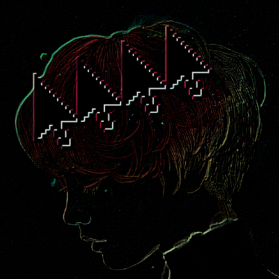

# example of filter use

<table>
<tr>
  <th>Original</th>
  <th>Downsampled</th>
  <th>Desaturated</th>
</tr>
<tr>
  <td></td>
  <td></td>
  <td></td>
</tr>
<tr>
  <th>diffOfGaussians</th>
  <th>horizontalSobel</th>
  <th>verticalSobal</th>
</tr>
<tr>
  <td></td>
  <td></td>
  <td></td>
</tr>
</table>

# ascii
> also inside bash code for colors
```bash
PPPocc;coPPoocccccccccc;;coPPPoocccoPPPPPOOOOOOOOOOOOOOOOOOOOOOOOPPoccoPOOOOOOOOOOOOOOOOOOOOOOOOOOOOOPPocccoPPPPoocccccccccccoPPPPocccoPPOOOOOOOOOOOOOOOOOOOOOOOOOPPPPoccooPPPOOOPPPOOOOOOOOOOPOOPPPPPPPPoccccoPPocccoooooooooooPPPocccooPPPPPPPP
PPPoc╱╲coPPPocccccccccccccoPPPPo╱╱coPPPOOOOOOOOOOOOOOOOOOOOOOOOOOPPo╲╲oPOOOOOOOOOOOOOOOOOOOOOOOOOOOOOOPo╲╲╱oPOPPoocccccccccccoPPOP╲╱╱╱╲POOOOOOOOOOOOOOOOOOOOOOOOOOOOPPo╱╲ooPPOOOOOOOOOOOOOOOOOOOOOOOOOOOPoc╱╱coPPocccoooooooooooPPPoc╱coPPPOOOOOO
PPPoo╱╲╲oPPPoccccccccccc;coPPPPoc╲coPPPPOOOOOOOOOOOOOOOOOOOOOOOOOPPo╱╲oPOOOOOOOOOOOOOOOOOOOOOOOOOOOOOOPo╲╲coPOPPoocccccccccccoPPOP╱╱╱╱╲POOOOOOOOOOOOOOOOOOOOOOOOOOOPPPoc╱ooPPOOOOOOOOOOOOOOOOOOOOOOOOOOOPoccccoPPocccoooooooooooPPPoc╲coPPPOOOOOO
PPPPoc╱╲oPPPoccccccccccc;coPPPPoc╲coPPPPOOOOOOOOOOOOOOOOOOOOOOOOOOPo╱╲oPOOOOOOOOOOOOOOOOOOOOOOOOOOOOOOPo╲╱╲oPOPPoocccccccccccoPOPcPOO╱╲POOOOOOOOOOOOOOOOOOOOOOOOOOOOPPoc╱ooPPOOOOOOOOOOOOOOOOOOOOOOOOOOOPoccccoPPocccoooooooooooPPPoc╲coPPPOOOOOO
PPPPoc╱╲oPPPoccccccccccc;coPPPPoc╲coPPPPOOOOOOOOOOOOOOOOOOOOOOOOOOPoo╲oPOOOOOOOOOOOOOOOOOOOOOOOOOOOOOOPo╲╱╲oPOPPoocccccccccc╲oPooOOOO╲╲POOOOOOOOOOOOOOOOOOOOOOOOOOOOPPoccooPPOOOOOOOOOOOOOOOOOOOOOOOOOOOPoc╲ccoPPocccoooooooooooPPPo╲╲coPPOOOOOOO
PPPPoc╲╲oPPPoccccccccccc;coPPPPoc╲╲oPPPOOOOOOOOOOOOOOOOOOOOOOOOOOOPoo╲oPOOOOOOOOOOOOOOOOOOOOOOOOOOOOOOPo╲╲╲oPOPPoocccccccccc╲╲cPOOOOO╲╲POOOOOOOOOOOOOOOOOOOOOOOOOOOOPPoccooPPOOOOOOOOOOOOOOOOOOOOOOOOOOOPoc╲ccoPPocccccoooooooooPPPo╲╲coPPOOOOOOO
PPPPoc╲╲cPPPoccccccccccc;coPPPPoc╲╲oPPOOOOOOOOOOOOOOOOOOOOOOOOOOOPPoo╲oPOOOOOOOOOOOOOOOOOOOOOOOOOOOOOOPo╲╲╲oPOOPooccccccccc╲╱╱POOOOOO╲╲POOOOOOOOOOOOOOOOOOOOOOOOOOOOPPoocooPOOOOOOOOOOOOOOOOOOOOOOOOOOOPPoc╲ccoPPocccccccccoooooPPPc╲╲coPPOOOOOOO
PPPPoc╲╲coPPoccccccccccc;coPPPPoc╲╲oPPOOOOOOOOOOOOOOOOOOOOOOOOOOOPPoo╱oPOOOOOOOOOOOOOOOOOOOOOOOOOOOOOOPo╲╲╲oPOOPoocccccccc╲╱╱OOOOOOOO╲╱POOOOOOOOOOOOOOOOOOOOOOOOOOOOPPoo╲ooPOOOOOOOOOOOOOOOOOOOOOOOOOOPPPoc╲ccoPPocccccccccccoooPPPc╲╲coPPOOOOOOO
PPPPoc╲╲coPPoccccccccccc;coPPPPoc╲╲oPPOOOOOOOOOOOOOOOOOOOOOOOOOOOOPoo╲oPOOOOOOOOOOOOOOOOOOOOOOOOOOOOOOPo╲╲╲oPOOPoccccccccc╲╱POOOOOOOO╲╲POOOOOOOOOOOOOOOOOOOOOOOOOOOOOPoc╲ooPOOOOOOOOOOOOOOOOOOOOOOOOOOPPPoc╲╲coPPoccccccccccccooPPPc╱╲coPPOOOOOOO
PPPPoc╲╲coPPoccccccccccc;coPPPPoc╲╲oPPOOOOOOOOOOOOOOOOOOOOOOOOOOOOPoo╲oPOOOOOOOOOOOOOOOOOOOOOOOOOOOOOOPo╲╲╲oPOOPocccccccc╲╱POOOOOOOOO╲╱POOOOOOOOOOOOOOOOOOOOOOOOOOOOOPoc╲ooPOOOOOOOOOOOOOOOOOOOOOOOOOOPPPoc╲╲coPPoccccccccccccooPPPc╲╲coPOOOOOOOO
PPPPoc╲╲coPPoccccccccccc;coPPPPoc╱╲oPPOOOOOOOOOOOOOOOOOOOOOOOOOOOOPo╲╲╲POOOOOOOOOOOOOOOOOOOOOOOOOOOOOOPo╲╲╲oPOOPocccccccc╱oOOOOOOOOOP╲╱POOOOOOOOOOOOOOOOOOOOOOOOOOOOOPoc╲ooPOOOOOOOOOOOOOOOOOOOOOOOOOOOPPoc╱╲coPPoccccccccccccooPPPc╲╲coPPOOOOOOO
PPPPoc╱╲coPPoccccccccccc;coPPPPoc╱╲cPPOOOOOOOOOOOOOOOOOOOOOOOOOOOOPo╲╲╲POOOOOOOOOOOOOOOOOOOOOOOOOOOOOOPo╲╲╲oPOOPoccccccc╲cOOOOOOOOOO╲╲╱POOOOOOOOOOOOOOOOOOOOOOOOOOOOOPoc╱ooPOOOOOOOOOOOOOOOOOOOOOOOOOOOPPoc╱╲coPPoccccccccccccooPPPc╲╲coPPOOOOOOO
PPPPoc╲╲coPPoccccccccccc;coPPPPoc╲╲cPPOOOOOOOOOOOOOOOOOOOOOOOOOOOOPo╱╲╱POOOOOOOOOOOOOOOOOOOOOOOOOOOOOOPo╲╲╲oPOOPocccccc╲╲POOOOOOOOOO╲╲╱POOOOOOOOOOOOOOOOOOOOOOOOOOOOOPoc╲ooPOOOOOOOOOOOOOOOOOOOOOOOOOOOPPoc╲╱coPPocccccccccccccoPPoc╲╱coPPOOOOOOO
PPPPoc╲╲coPPoccccccccccc;coPPPPoc╲╲coPOOOOOOOOOOOOOOOOOOOOOOOOOOOOPo╲╲oPOOOOOOOOOOOOOOOOOOOOOOOOOOOOOOPo╲╲╲oPOOPocccccc╲╱OOOOOOOOOOP╲╱oPOOOOOOOOOOOOOOOOOOOOOOOOOOOOOPoc╲coPOOOOOOOOOOOOOOOOOOOOOOOOOOOPPoc╲╱coPPocccccccccccccoPPoc╲╱coPPOOOOOOO
PPPPoc╲╲coPPoccccccccccc;coPPPPoc╲╱coPOOOOOOOOOOOOOOOOOOOOOOOOOOOOPo╲╲oPOOOOOOOOOOOOOOOOOOOOOOOOOOOOOOPo╲╲╲oPOOPocccccc╱oOOOOOOOOOO╲╲╱oPOOOOOOOOOOOOOOOOOOOOOOOOOOOOOPoc╲coPPOOOOOOOOOOOOOOOOOOOOOOOOOOPPoc╲ccoPPocccccccccccccoPPoc╲╲coPPOOOOOOO
PPPPoc╲╲coPPoocccccccccc;;oPPPPoc╲╲coPOOOOOOOOOOOOOOOOOOOOOOOOOOOOPo╲╲oPOOOOOOOOOOOOOOOOOOOOOOOOOOOOOOPo╲╲╲oPOOPoccccc╲╱POOOOOOOOOP╲╱╱oPOOOOOOOOOOOOOOOOOOOOOOOOOOOOOPoc╲coPPOOOOOOOOOOOOOOOOOOOOOOOOOOOPoc╲ccoPPocccccccccccccoPPoc╲╲coPPOOOOOOO
PPPPoc╱╲coPPoocccccccccc;;cPPPPoc╲╲coPOOOOOOOOOOOOOOOOOOOOOOOOOOOOPo╲╲oPOOOOOOOOOOOOOOOOOOOOOOOOOOOOOOPo╲╲╲oPOOPoccccc╲╲OOOOOOOOOO╲╱╱╱oPOOOOOOOOOOOOOOOOOOOOOOOOOOOOOPoc╲coPPOOOOOOOOOOOOOOOOOOOOOOOOOOOPoc╲ccoPPocccccccccccccoPPoc╱╲coPPOOOOOOO
PPPPoc╲╲coPPoocccccccccc;;cPPPPoc╲╲coPOOOOOOOOOOOOOOOOOOOOOOOOOOOOPo╱╲oPOOOOOOOOOOOOOOOOOOOOOOOOOOOOOOPo╲╲╲oPOOPoocccc╲╲OOOOOOOOOo╱╱╱coPOOOOOOOOOOOOOOOOOOOOOOOOOOOOOPoc╲coPPOOOOOOOOOOOOOOOOOOOOOOOOOOOPoc╱ccoPPocccccccccccccoPPoc╲╲coPPOOOOOOO
OPPPoc╲╲coPPPocccccccccc;;cPPPPPc╲╲coPOOOOOOOOOOOOOOOOOOOOOOOOOOOOPo╲╲oPOOOOOOOOOOOOOOOOOOOOOOOOOOOOOOPo╲╲╲oPOOPoocccc╲╲OOOOOOOOPoo╱╲coPOOOOOOOOOOOOOOOOOOOOOOOOOOOOOPoc╲coPPOOOOOOOOOOOOOOOOOOOOOOOOOOOPoc╲ccoPPocccccccccccccoPPoc╲╱coPPOOOOOOO
OOPPoc╱╲coPPPocccccccccc;;cPPPPPc╲╲╲oPOOOOOOOOOOOOOOOOOOOOOOOOOOOOPo╲╲ooPOOOOOOOOOOOOOOOOOOOOOOOOOOOOOPo╲╲╲oPOOPoocccc╲╲OOOOOOOOoPo╲╲╲oPOOOOOOOOOOOOOOOOOOOOOOOOOOOOOPoc╲coPPOOOOOOOOOOOOOOOOOOOOOOOOOOOPoc╲ccoPPocccccccccccccoPPoc╲╲coPPOOOOOOO
OOPPoc╲╲coPPPocccccccccc;;coPPPPo╲╲╲oPOOOOOOOOOOOOOOOOOOOOOOOOOOOOPo╲╲╲oPOOOOOOOOOOOOOOOOOOOOOOOOOOOOOPo╲╲╲╲POOPo╲cccc╲╲OOOOOOOoOPo╲╲╲oPOOOOOOOOOOOOOOOOOOOOOOOOOOOOOPoc╲coPOOOOOOOOOOOOOOOOOOOOOOOOOOOPPoc╲ccoPPocccccccccccccoPPoc╲╲coPOOOOOOOO
OOPPoc╲╲coPPPocc;;;;cccc;;coPPPPo╲╲╲oPOOOOOOOOOOOOOOOOOOOOOOOOOOOOPo╲╲╲oPOOOOOOOOOOOOOOOOOOOOOOOOOOOOOP╲╱╱╱╱ooooo╱╱╲╲╲╲╲OOOOOO╲POPo╲╱╲╲POOOOOOOOOOOOOOOOOOOOOOOOOOOOOPoc╲coPOOOOOOOOOOOOOOOOOOOOOOOOOOOPPoc╱ccoPPocccccccccccccoPPoc╲╲coPPOOOOOOO
OOOPPc╱╲coPPPocc;;;;;ccc;;coPPPPo╲╲╲oPOOOOOOOOOOOOOOOOOOOOOOOOOOOOPo╱╲╲oPOOOOOOOOOOOOOOOOOOOOOOOOOO╲Poo╱╱╱PPPPPPPooc╱╱╲╲POOOO╲╲Pooc╱╱╱╱coooPP╲OOOOOOOOOOOOOOOOOOOOOOOPo╲╲coPOOOOOOOOOOOOOOOOOOOOOOOOOOOPPoc╲ccoPPocccccccccccccoPPoc╲╲coPPOOOOOOO
OOOPPc╲╲coPPPoc;;;;;;;;;;;coPPPPo╱╲╲oPOOOOOOOOOOOOOOOOOOOOOOOOOOOOPo╱╲╲oPOOOOOOOOOOOOOOOOOOOOOO╲P╲╱╱POOOOOOOOOOOOOOOPo╱╱╲OOO╲╱╱PPOOOOOOOOOOOP╱╱╲╲OOOOOOOOOOOOOOOOOOOOPo╲╲coPOOOOOOOOOOOOOOOOOOOOOOOOOOOPPoc╲ccoPPocccccccccccccoPPoc╲╲coPPPOOOOOO
OOOPPo╲╲╲oPPPoc;;;;;;;;;;;coPPPPo╲╱╲oPOOOOOOOOOOOOOOOOOOOOOOOOOOOOPoo╲╲oPOOOOOOOOOOOOOOOOOOOO╲╲╱POOOOOOOOOOOOOOOOOOOOOO╱POOo╱╱╱PPPPPOOOOOOOOOOO╱╱╱╱╲OOOOOOOOOOOOOOOOOPo╱╲coPOOOOOOOOOOOOOOOOOOOOOOOOOOOPPoc╲ccoPPocccccccccccccoPPoc╲╲coPPPPOOOOO
OOOPPo╲╲╲oPPPoc;;;;;;;;;;;coPPPPo╲╲╲oPOOOOOOOOOOOOOOOOOOOOOOOOOOOOPoo╲╲oPOOOOOOOOOOOOOOOOOP╲╱╱OOOOOOOOOOOOOOOPPPPPPPoPOOOOOOOPPPPPPPPoPOOOOOOOOOOOO╱o╲╲╲OOOOOOOOOOOOOPo╲╲coPOOOOOOOOOOOOOOOOOOOOOOOOOOOPPo╲╲ccoPPocccccccccccccoPPoc╲╲coPPPPPOOOO
OOOPPo╲╲╲oPPPoc;;;;;;;;;;;coPPPPo╱╲╲oPOOOOOOOOOOOOOOOOOOOOOOOOOOOOPoo╲╲oPOOOOOOOOOOOOOO╲╲╲POOOOOOOOOOOOOOP╲╲PPPOOOOOOOOOOOOOOOOOOOOOOOO╲╲OOOOOOOOOOOOO╱╱╲╲OOOOOOOOOOOPo╲╲coPOOOOOOOOOOOOOOOOOOOOOOOOOOOPPo╲╲ccoPPoccccccccccccooPPoc╲╲coPPPPPOOOO
OOOPPo╲╲╲cPPPoc;;;;;;;;;;;coPPPPo╱╲╲oPOOOOOOOOOOOOOOOOOOOOOOOOOOOOPPo╲╲oPOOOOOOOOOOOO╲╲╱OOOOOOOOOOOOOOP╲POOOOOOOOOOOOOOOOOOOOOOOOOOOOOOO╱POOOOOOOOOOOOOO╱╱POOOOOOOOOOPo╲╲coPOOOOOOOOOOOOOOOOOOOOOOOOOOOOPo╲╲ccoPPoccccccccccccooPPoc╲╲coPPPPPOOOO
OOOPPo╱╲╲cPPPoc;;;;;;;;;;;coPPPPo╲╲╱oPOOOOOOOOOOOOOOOOOOOOOOOOOOOOOPo╲╲oPOOOOOOOOOO╲╲╱╱OOOOOOOOOOO╲╲╲POOOOOOOOOOOOOOOOOOOOOOOOOOOOOOOOOOOOOOOOOOOOOOOOOOOOOo╲╲OOOOOOOPo╲╲coPOOOOOOOOOOOOOOOOOOOOOOOOOOOOPo╱╲ccPPPoccccccccccccooPPoc╲╲cPPPPPPOOOO
OPPPPo╱╲╲cPPPoc;;;;;;;;;;;;oPPPPo╲╲╱oPPOOOOOOOOOOOOOOOOOOOOOOOOOOOOPo╲╲oPOOOOOOOO╲╲╱╱OOOOOOOOOOOOO╲╱OOOOOOOOOOOOOOOOOOOOOOOOOOOOOOOOOOOOOOOOOOOOOOOOOOOOOOOO╱╱╲OOOOOOPo╲╱coPOOOOOOOOOOOOOOOOOOOOOOOOOOOOPo╱╲ccPPPcccccccccccccooPPo;╲╲cPPPPPPPOOO
PPPPPoc╲╲cPPPoc;;;;;;;;;;;;oPPPPo╱╲╲cPPOOOOOOOOOOOOOOOOOOOOOOOOOOOOPo╲╱oPOOOOOOOo╱╱OOOOOOOOOOOO╲╲╱╱OOOOOOOOOOOOOOOOOOOOOOOOOOOOOOOOOOOOOOOOOOOOOOOOOOOOOOOOOOO╱╲╲OOOOPo╲╱ooPOOOOOOOOOOOOOOOOOOOOOOOOOOOPPoc╲ccPPocccccccccccccooPPo╲╲╲cPPPPPPPPOO
PPPPPoc╱╲coPPoc;;;;;;;;;;;;cPPPPoc╲╲cPPOOOOOOOOOOOOOOOOOOOOOOOOOOOOPo╲╲oPOOOOO╲╱OOOOOOOOOOOOOO╲╲╱OOOOOOOOOOOOOOOOOOOOOOOOOOOOOOOOOOOOOOOOOOOOOOOOOOOOOOOOOOOOOOO╱╲OOOPo╲╲ooPOOOOOOOOOOOOOOOOOOOOOOOOOOOPPoc╲coPPocccccccccccccooPPo╲╲╲cPPPPPPPPPO
OOOOPoc╲╲coPPoc;;;;;;;;;;;;coPPPoc╲╲coPOOOOOOOOOOOOOOOOOOOOOOOOOOOOPo╱╲oPOOOP╱╱OOOOOOOOOOOOOO╲╱╱OOOOOOOOOOOOOOOOOOOOOOOOOOOOOOOOOOOOOOOOOOOOOOOOOOOOOOOOOOOOOOOOOOoPOPo╲╲ooPOOOOOOOOOOOOOOOOOOOOOOOOOOOPPoc╲coPPocccccccccccccooPPc╲╲╲cPPPPPPPPPP
POOOPoc╲╲coPPoc;;;;;;;;;;;;coPPPoc╲╲coPOOOOOOOOOOOOOOOOOOOOOOOOOOOOPo╲╲oPOOoPOOOOOOOOOOOOOO╲╲╱OOOOOOOOOOOOOOOOOOOOOOOOOOOOOOOOOOOOOOOOOOOOOOOOOOOOOOOOOOOOOOOOOOOOOPoP╲╲╲ooPOOOOOOOOOOOOOOOOOOOOOOOOOOPPPc╲╲coPPocccccccccccccooPPc╲╱╲oPPPPPPPPPO
PPPPPoc╲╲coPPoc;;;;;;;;;;;;coPPPoc╲╲coPOOOOOOOOOOOOOOOOOOOOOOOOOOOOPo╲╲╲PPoPOOOOOOOOOOOOOO╲╲╱OOOOOOOOOOOOOOOOOOOOOOOOOOOOOOOOOOOOOOOOOOOOOOOOOOOOOOOOOOOOOOOOOOOOOOOOo╱╲╲╲oPOOOOOOOOOOOOOOOOOOOOOOOOOPPPPc╲╱coPPoc;;ccccccccccooPoc╲╱╱oPPPPPPPPPP
PPPPPoc╲╲coPPoc;;;;;;;;;;;;coPPPoc╲╲coPOOOOOOOOOOOOOOOOOOOOOOOOOOOOP╲╲╲╲ooOOOOOOOOOOOOOOO╲╱╱OOOOOOOOOOOOOOOOOOOOOOOOOOOOOOOOOOOOOOOOOOOOOOOOOOOOOOOOOOOOOOOOOOOOOOOOOOo╱╱╲oPOOOOOOOOOOOOOOOOOOOOOOOOOPPPPc╲╲coPPoc;;cccccccccccoPoc╱╲╲oPPPPPPPPPP
PPPPPoc╲╲coPPoc;;;;;;;;;;;;coPPPoc╲╲coPPOOOOOOOOOOOOOOOOOOOOOOOOOOOP╲╲╱╱POOOOOOOOOOOOOOO╲╱OOOOOOOOOOOOOOOOOOOOOOOOOOOOOOOOOOOOOOOOOOOOOOOOOOOOOOOOOOOOOOOOOOOOOOOOOOOOO╱╱╱╲POOOOOOOOOOOOOOOOOOOOOOOOOPPPoc╲╲coPPoc;;ccccccccccooPoc╲╲╲oPPPPPPPPPP
PPPPPoc╲╲coPPoc;;;;;;;;;;;;coPPPoc╱╲coPPOOOOOOOOOOOOOOOOOOOOOOOOOOOP╲╱╱OOOOOOOOOOOOOOOOO╱╱OOOOOOOOOOOOOOOOOOOOOOOOOOOOOOOOOOOOOOOOOOOOOOOOOOOOOOOOOOOOOOOOOOOOOOOOOOOOOOO╱╲POOOOOOOOOOOOOOOOOOOOOOOOPPPPoc╲╲coPPoc;;ccccccccccooPoc╲╱╱oPPPPPPPPPP
PPPPPoc╱╲coPPPoc;;;;;;;;;;;coPPPoc╱╲coPPOOOOOOOOOOOOOOOOOOOOOOOOOOOP╱╱OOOOOOOOOOOOOOOOOPOOOOOOOOOOOOOOOOOOOOOOOOOOOOOOOOOOOOOOOOOOOOOOOOOOOOOOOOOOOOOOOOOOOOOOOOOOOOOOOOOO╱oOOOOOOOOOOOOOOOOOOOOOOOPPPPPoc╲╲coPPoc;;ccccccccccooPoc╲╱╱oPPPPPPPPPP
PPPPPoc╱╲coPPPoc;;;;;;;;;;;coPPPoc╱╱coPPOOOOOOOOOOOOOOOOOOOOOOOOOOP╱╱OOOOOOOOOOOOOOOOOOOOOOOOOOOOOOOOOOOOOOOOOOOOOOOOOOOOOOOOOOOOOOOOOOOOOOOOOOOOOOOOOOOOOOOOOOOOOOOOOOOOOOP╲╲PPPPPPPPPPPPPPPPPPPPPPPPPPoc╱╱coPPoc;;ccccccccccooPoc╱╲coPPPPPPPPPP
PPPPPoc╱╱coPPPoc;;;;;;;;;;;coPPPoc╱╱coPPPPPOOOOOPPPPPPPPPPPPPPPP╲╲oPOOOOOOOOOOOOOOOOOOOOOOOOOOOOOOOOOOOOOOOOOOOOOOOOOOOOOOOOOOOOOOOOOOOOOOOOOOOOOOOOOOOOOOOOOOOOOOOOOOOOOOOOO╱╲╲PPPPPPPPPPPPPPPPPPPPPPPPoc╱╱coPPoc;;ccccccccccooPoc╲╲coPPPPPPPPPP
PPPPPoc╱╱;oPPPoc;;;;;;;;;;;coPPPPc╲╱ccoPPPPPPPPPPPPPPPPooooooo╲╲╲╱OOOOOOOOOOOOOOOOOOOOOOOOOOOOOOOOOOOOOOOOOOOOOOOOOOOOOOOOOOOOOOOOOOOOOOOOOOOOOOOOOOOOOOOOOOOOOOOOOOOOOOOOOOOO╱╲╲╲╲ooooooooooooooooooooooc;╲coPPoc;;ccccccccccooPoc╲╱coPPPPPPPPPP
PPPPPoc╱╱;oPPPoc;;;;;;;;;;;coPPPPc╲╲ccooooooooooooooo╲╲╲╲╲╲╲╲╲╲╲╱OOOOOOOOOOOOOOOOOOOOOOOOOOOOOOOOOOOOOOOOOOOOOOOOOOOOOOOOOOOOOOOOOOOOOOOOOOOOOOOOOOOOOOOOOOOOOOOOOOOOOOOOOOOOOO╱╱╲╲╲╲╲╲╲╲╲╲╲╲╲╲╲c╲cc╲ccccc;╲coPPoc;;ccccccccccoPPoc╲╱coPPPPPPPPPP
ooooocc;╲╲oPPPoc;;;;;;;;;;;;oPPPPc╲╲╲ccc╲╲╲╲╲╲╲╲╲╲╲╲╲╲╲╲╲╲╲╲╲╲╱╱OOOOOOOOOOOOOOOOOOOOOOOOOOOOOOOOOOOOOOOOOOOOOOOOOOOOOOOOOOOOOOOOOOOOOOOOOOOOOOOOOOOOOOOOOOOOOOOOOOOOOOOOOOOOOOOO╱╱╲╲╲╱╱╱╲╱╲╲╲╲╲╲╲╲╲╲╲╲╲╲;╲╲╲╲oPPoc;;ccccccccccoPPoc╲;ccooPPPPPPPP
cccccc;;╲╲cPPPoc;;;;;;;;;;;;oPPPPc╲╱╲;╲╲╱╱╱╱╱╱╱╱╱╱╱╱╱╱╱╱╱╱╱╱╱╱╱OOOOOOOOOOOOOOOOOOOOOOOOOOOOOOOOOOOOOOOOOOOOOOOOOOOOOOOOOOOOOOOOOOOOOOOOOOOOOOOOOOOOOOOOOOOOOOOOOOOOOOOOOOOOOOOOOO╱╱╱╱╱╱╱╱╱╱╱╱╱╱╱╱╱╱╱╱╱╱╱;╱╱╱╱oPPoc;;ccccccccccooPoc╲╲cccooooooooo
╲╲╲╲╲╲╲╲╲╱cPPPoc;;;;;;;;;;;;cPPPPo╱╱╱;cc╱╱╱╱cccccooooooooooo╱╱??OOOOOOOOOOOOOOOOOOOOOOOOOOOOOOOOOOOOOOOOOOOOOOOOOOOOOOOOOOOOOOOOOOOOOOOOOOOOOOOOOOOOOOOOOOOOOOOOOOOOOOOOOOOOOOOO?O╱╱Poooooooooooooooccccccc╱coPPoc;;ccccccccccooPoc╲╲;;cccccccccc
╱╱╱╱╱╱╱╱╱╱ooPPoc;;;;;;;;;;;;coPPPoooooooooooooPPPPPPPPPPPPPPo????OOOOOOOOOOOOOOOOOOOOOOOOOOOOOOOOOOOOOOOOOOOOOOOOOOOOOOOOOOOOOOOOOOOOOOOOOOOOOOOOOOOOOOOOOOOOOOOOOOOOOOOOOOOOO?????PoPPPPPPPPPPPPPPPPPoooooooPPPoc;;ccccccccccooPoc╱╱╱;;╲╲╲╲╲╲╲╲╲
cccccccccooPPPoc;;;;;;;;;;;;coPPPPPPPPPPPPPPPPPPPPPPPPPPPPPo?????OOOOOOOOOOOOOOOOOOOOOOOOOOOOOOOOOOOOOOOOOOOOOOOOOOOOOOOOOOOOOOOOOOOOOOOOOOOOOOOOOOOOOOOOOOOOOOOOOOOOOOOOOOOOO??????Po╲PPPPPPPPPPPPPPPPPPPPPPPPPoc;;ccccccccccooPoccccc;;╱╱╱╱╱╱╱╱
oooooooooPPPPPoc;;;;;;;;;;;;coPPPPPPPPPPPPPPPPPPPPPPPPP╲╲╲╱?????OOOOOOOOOOOOOOOOOOOOOOOOOOOOOOOOOOOOOOOOOOOOOOOOOOOOOOOOOOOOOOOOOOOOOOOOOOOOOOOOOOOOOOOOOOOOOOOOOOOOOOOOOOOOOO???????P╲╲╲ooooooooooooooooooooooooc;cccccccccccooPoooooooocccccccc
PPPPPPPPPPPPPPoc;;;;;;;;;;;;cooooooooooooooooooo╲╲oooo╲╲╲╱O?????O╲OOOOOOOOOOOOOOO╲POOOOOOOOOOOOOOOOOOOOOOOOOOOOOOOOOOOOOOOOOOOOOOOOOOOOOOOOOOOOOOOOOOOOOOOOOOOOOOOOOOOOOOOOOOO????????╱╲╲╲╲ccc╲╲╲ccccccccccccccccccccccccccccccoooooooooooooooooo
PPPPooooooooooccc;;;;;;;;;;cccccccccccccccccc╲╲╲╱╱ccc╲╲╲╱╱??????╲╲OOOOOOOOOOOOOO╲╱OOOOOOOOOOOOOOOOOOOOOOOOOOOOOOOOOOOOOOOOOOOOOOOOOOOOOOOOOOOOOOOOOOOOOOOOOOOOOOOOOOOOOOOOOOOO?????????╱╱╲╲ooc╱╱╲╲╲;;;;;;cccccccccccccccccccccccooooooooooooooooo
oooocccccccccccc;;;;;;;;;;;;;;;;;;;;;;;;;,,,╲╲╲╱oPOOO╲╲╱╱??????╲╱╱OOOOOOOOOOOOO╲╱OOOOOOOOOOOOOOOOOOOOOOOOOOOOOOOOOOOOOOOOOOOOOOOOOOOOOOOOOOOOOOOOOOOOOOOOOOOOOOOP╲OOOOOOOOOOOO╲?????????╱╱╲cOOP╱╱╲╲,,,,,,,,,;;;;;;;;;;;;;cccccccccccccccccccccccc
cccccc;;;;;;;;;;;;;;;;;;;;;;;;;;;;,,,,,,,,,╲╲╲╱oOOOO╲╲╱╱???????╱╱??OOOOOOOOOOO╲╱OOOOOOOOOOOOOOOOOOOOOOOOOOOOOOOOOOOOOOOOOOOOOOOOOOOOOOOOOOOOOOOOOOOOOOOOOOOOOOOOO╱╲OOOOOOOOOOO╲?????????O╱╲╲oOOO╱╱╲,,,,,,,,,,,,,,,,,,;;;;;;;;;;;;;;;;;;;;;;cccccc
;;;;;;;;;;;;;;;;;;;;;;;;;;;;,,,,,,,,,,,,,,,╲╲╱╱OOOO╲╲╱╱?????????????OOOOOOOOO╲╲╱OOOOOOOOOOOOOOOOOOOOOOOOOOOOOOOOOOOOOOOOOOOOOOOOOOOOOOOOOOOOOOOOOOOOOOOOOOOOOOOOO╱╱OOOOOOOOOOO╱??????????╱╱╲╲POOP╱╲╲,,,,,,,,,,,,,,,,,,,,,,,;;;;;;;;;;;;;;;;;;;;;;
;;;;;;;;;;;;;;;;;;;;;;;,,,,,,,,,,,,,,,,,,,╲╲╱╱cOOO╲╲╱╱?????????????OOOOOOOOO╲╲╱OO?OOOOOOOOOOOOOOOOOOOOOOOOOOOOOOOOOOOOOOOOOOOOOOOOOOOOOOOOOOOOOOOOOOOOOOOOOOOOOOOO╱╲╲OOOOOOOO?????????????╱╱╲╲POO;╱╲╲,,,,,,,,,,,,,,,,,,,,,,,,,;;;;;;;;;;;;;;;;;;;
;;;;;;;;;;;;;;;;;;,,,,,,,,,,,,,,,,,,,,,,,,╱╱╱cOOOP╲╲╱O?????????????OOOOOOOO╲╲╱OO???OOOOOOOOOOOOOOOOOOOOOOOOOOOOOOOOOOOOOOOOOOOOOOOOOOOOOOOOOOOOOOOOOOOOOOOOO??OOOOO╱╲OOOOOOOO??????????????╱╱╲╲OOc╱╱╱╲,,,,,,,,,,,,,,,,,,,,,,,,,;;;;;;;;;;;;;;;;;;
;;;;,,,,,,,,,,,,,,,,,,,,,,,,,,,,,,,,,,,,╲╲,cOOOOO╲╲╱╱?????????????OOOOOOOO╲╲╱╱O????OOOOOOOOOOOOOOOOOOOOOOOOOOOOOOOOOOOOOOOOOOOOOOOOOOOOOOOOOOOOOOOOOOOOOOOO?????OOOO╱╲OOOOOOO???????????????╱╱╲oOOOo,╲╲,,,,,,,,,,,,,,,,,,,,,,,,,,,,,,,,,,,,,,;;;;
,,,,,,,,,,,,,,,,,,,,,,,,,,,,,,,,,,,,,,,,╲╱oOOOOO╲╲╱╱??????????????OOOOOOOO╲╱OO????OOOOOOOOOOOOOOOOOOOOOOOOOOOOOOOOOOOOOOOOOOOOOOOOOOOOOOOOOOOOOOOOOOOOOOOOOO????OOOOO╱╲OOOOOO???????????????P╱╲╲POOOo╱╲,,,,,,,,,,,,,,,,,,,,,,,,,,,,,,,,,,,,,,,,,,
,,,,,,,,,,,,,,,,,,,,,,,,,,,,,,,,,,,,,,,╲╱cOOOOO╲╲╱╱??????????????OOOOOOOO╲╲╱O?????OOOOOOOOOOOOOOOOOOOOOOOOOOOOOOOOOOOOOOOOOOOOOOOOOOOOOOOOOOOOOOOOOOOOOOOOOO?????OOOOO╲OOOOOOO???????????????╱╱╲╲POOOc╱╲,,,,,,,,,,,,,,,,,,,,,,,,;,,,,,,,,,,,,,,,,
,,,,,,,,,,,,,,,,,,,,,,,,,,,,,,,,,,,,,,,╲╱POOOOO╲╲╱O??????????????OOOOOOO╲╲╱OO????OOOOOOOOOOOOOOOOOOOOOOOOOOOOOOOOOOOOOOOOOOOOOOOOOOOOOOOOOOOOOOOOOOOOOOOOOOOO????OOOOO╱╲OOOOOO????????????????╱╱╲╲OOOP,╲,,,,,,,,,,,,,,,,,,,,,,,,;;;;;;;;;;;;;,,,,
,,,,,,,,,,,,;,;;,,,,,,,,,,,,,,,,,,,,,,╲╲cOOOOO╲╲╱╱??????????????OOOOOOOO╲╱OO?????OOOOOOOOOOOOOOO╲OOOOOOOOOOOOOOOOOOOOOOOOOOOOOOOOOOOOOOOOOOOOOOOOOOOOOOOOOOOO?????OOOOO╱╲OOOOOO???????????????O╱╲╲oOOOc╲╲,,,,,,,,,,,,,,,,,,,,,,,;;;;;;;;;;;;;;;;;
,,,,,,,,,,,,,,,;;,,,,,,,,,,,,,,,,,,,,,╲╱POOOO╲╲╱╱??????????????OOOOOOOO╲╱OO?????OOOOOOOOOOOOOOO╲╲OOOOOOOOOOOOOOOOOOOOOOOOOOOOOOOOOOOOOOOOOOOOOOOOOOOOOOOOOOOOO????OOOOOO╲╲OOOOOO???????????????╱╱╲╲POOo╱╲╲,,,,,,,,,,,,,,,,,,,,,,,,,,,,,,,,,,,,,,,
,,,,,,,,,,,,,,,;;,,,,,,,,,,,,,,,,,,,,╲╲╱OOOOO╲╲╱O???????╲??????OOOOOOOO╲╱OO????OOOOOOOOOOOOOOOO╱╱OOOOOOOOOOOOOOOOOOOOOOOOOOOOOOOOOOOOOOOOOOOOOOOOOOOOOOOOOOOOOO???OOOOOO╱╲OOOOOOO?????╲?????????╱╱╲╲OOO╱╱╲,,,,,,,,,,,,,,,,,,,,,;;;,,,,,,,,,,,,,,,
,,,,,,,,,,,;;;;;;,,,,,,,,,,,,,,,,,,,╲╱╱cOOOO╲╲╱╱????????╲?????OOOOOOOO╲╱OOO???OOOOOOOOOOOOOOOOO╲╱OOOOOOOOOOOOOOOOOOOOOOOOOOOOOOOOOOOOOOOOOOOOOOOOOOOOOOOOOOOOOOOOOOOOOOOO╱OOOOOOOO????╱╲????????O╱╱╲oOOP╱╱╲,,,,,,,,,,,,,,,,,,,,;;;;;;;;;;;;;,,,,,
,;;;;;;;;;;;;;;;;,,,,,,,,,,,,,,,,,,╲╱;oOOOOP╲╱╱O???????╲╱????OOOOOOOO╲╱OOOO??OOOOOOOOOOOOOOOOOO╲╱OOOOOOOOOOOOOOOOOOOOOOOOOOOOOOOOOOOOOOOOOOOOOOOOOOOOOOOOOOOOOOOOOOOOOOOO╱╲OOOOOOOO??O╱╱OO???????╱╱╲╲POOOo,╲,,,,,,,,,,,,,,,,,,;;;;;;;;;;;;;;;;;;;
;;;;;;;;;;;;;;;;;,,,,,,,,,,,,,,,,,,╲;POOOOO╲╲╱╱???????O╱╱???OOOOOOOOO╲OOOOOOOOOOOOOOOOOOOOOOOOO╲OOOOOOOOOOOOOOOOOOOOOOOOOOOOOOOOOOOOOOOOOOOOOOOOOOOOOOOOOOOOOOOOOOOOOOOOOO╱╲OOOOOOOOOOOOOOO???????╱╱╲╲OOOOo╱╲,,,,,,,,,,,,,,,,,;;;;;;;;;;;;;;;;;;;
;;;;;;;;;;;;;;;;;;,,,,,,,,,,,,,,,,╲╱oOOOOO╲╲╱╱O??????OO╱OO?OOOOOOOOO╲╱OOOOOOOOOOOO╲OOOOOOOOOOOO╱OOOOOOOOOOOOOOOOOOOOOOOOOOOOOOOOOOOOOOOOOOOOOOOOOOOOOOOOOOOOOOOOOOOOOOOOOOO╲╲OOOOOOOOOOOOOOOO?????P╱╱╲oOOOO;╱,,,,,,,,,,,,,,,,,;;;;;;;;;;;;;;;;;;;
;;;;;;;;;;;,;;;;;;,,,,,,,,,,,,,,,,╲╱POOOOO╲╲╱PO?????OOOOOOOOOOOOOOOO╱╱OOOOOOOOOOO╲╲OOOOOOOOOOOO╱OOOOOOOOOOOOOOOOOOOOOOOOOOOOOOOOOOOOOOOOOOOOOOOOOOOOOOOOOOOOOOOOOOOOOOOOOOO╱╲OOOOOOOOOOOOOOOOO????O╱╱╲╲OOOOo╱╲,,,,,,,,,,,,,,,;;;;;;;;;;;;;;;;;;;;
;;;;;;;;;;,,;;;;;;,,,,,,,,,,,,,,,,╲;OOOOO╲╲╱╱PO????OOOOOOOOOOOOOOOO╲╱OOOOOOOOOOOO╲╱OOOOOOOOOOOO╱OOOOOOOOOOOOOOOOOOOOOOOOOOOOOOOOOOOOOOOOOOOOOOOOOOOOOOOOOOOOOOOOOOOOOOOOOOOO╱OOOOOOOOOOOOOOOOOOOOOOO╱╱╲╲OOOO;╲,,,,,,,,,,,,,,,;;;;;;;;;;;;;;;;;;;;
;;;;;;;;;;,,,;;;;;,,,,,,,,,,,,,,,,╱cOOOOP╲╱╱OoOO?OOOOOOOOOOOOOOOOOO╲OOOOOOOOOOOOO╱OOOOOOOOOOOO╲OOOOOOOOOOOOOOOOOOOOOOOOOOOOOOOOOOOOOOOOOOOOOOOOOOOOOOOOOOOOOOOOOOOOOOOOOOOOO╱╲OOOOOOOOOOOOOOOOOOOOOPo╱╲╲POOOc╱,,,,,,,,,,,,,,,;;;;;;;;;;;;;;;;;;;;
;;;;;;;;;;,,,;;;;;;,,,,,,,,,,,,,,╲╲oOOOO╲╲╱oOoOOOOOOOOOOOOOOOOOOOO╲╱OOOOOOOOOOOO╲╱OOOOOOOOOOOO╲OOOOOOOOOOOOOOOOOOOOOOOOOOOOOOOOOOOOOOOOOOOOOOOOOOOOOOOOOOOOOOOOOOOOOOOOOOOOOO╲OOOOOOOOOOOOOOOOOOOOOoP╱╱╲╲OOOo╱╲,,,,,,,,,,,,,,;;;;;;;,;;;;;;;;;;;;
;;;;;;;;;;,,,;;;;;;,,,,,,,,,,,,,,╲╲oOOOP╲╱╱OPPOOOOOOOOOOOOOOOOOOOO╲OOOOOOOOOOOOO╲OOOOOOOOOOOOO╲OOOOOOOOOOOOOOOOOOOOOOOOOOOOOOOOOOOOOOOOOOOOOOOOOOOOOOOOOOOOOOOOOOOOOOOOOOOOOO╱╲OOOOOOOOOOOOOOOOOOOOPPP╱╲╲oOOP╱╲,,,,,,,,,,,,,;;;;;;;;,;;;;;;;;;;;;
;;;;;;;;;;,,,;;;;;;,,,,,,,,,,,,,,╲╱oOOO╲╲╱POPOOOOOOOOOOOOOOOOOOOO╲╱OOOOOOOOOOOO╲╲OOOOOOOOOOOOO╲OOOOOOOOOOOOOOOOOOOOOOOOOOOOOOOOOOOOOOOOOOOOOOOOOOOOOOOOOOOOOOOOOOOOOOOOOOOOOOO╲╲OOOOOOOOOOOOOOOOOOOOoOc╱╲╲OOP,╱╲,,,,,,,,,,,,;;;;;;;;,;;;;;;;;;;;;
,,,,,;;;;;,,,;;;;;;;,,,,,,,,,,,,,╱╱oOOP╲╱╱OOoOOOOOOOOOOOOOOOOOOOO╲╱OOOOOOOOOOOO╲╱OOOOOOOOOOOOO╲OOOOOOOOOOOOOOOOOOOOOOOOOOOOOOOOOOOOOOOOOOOOOOOOOOOOOOOOOOOOOOOOOOOOOOOOOOOOOOO╱╲OOOOOOOOOOOOOOOOOOOOoOO╱╱╲oOOc╱╱,,,,,,,,,,,,;;;;;;;;,;;;;;;;;;;;;
,,,,;;;;;;,,,;;;;;;;,,,,,,,,,,,,,╱coOO╲╲╱POOoOOOOOOOOOOOOOOOOOOOO╱OOOOOOOOOOOOO╲OOOOOOOOOOOOOO╱OOOOOOOOOOOOOOOOOOOOOOOOOOOOOOOOOOOOOOOOOOOOOOOOOOOOOOOOOOOOOOOOOOOOOOOOOOOOOOOO╲OOOOOOOOOOOOOOOOOOOOoOOo╱╲╲OPoo;,,,,,,,,,,,;;;;;;;;;,;;;;;;;;;;;;
,;;;;;;;;;,,,;;;;;;;,,,,,,,,,,,,,;ooPP╲╱╱OOOPOOOOOOOOOOOOOOOOOOO╲OOOOOOOOOOOOOO╲OOOOOOOOOOOOOO╱OOOOOOOOOOOOOOOOOOOOOOOOOOOOOOOOOOOOOOOOOOOOOOOOOOOOOOOOOOOOOOOOOOOOOOOOOOOOOOOO╱╲OOOOOOOOOOOOOOOOOOOoOOO╱╱╲coooo;,,,,,,,,,,;;;;;;;;;,;;;;;;;;;;;;
,;;;;;;;;;;,,;;;;;;;;,,,,,,,,,,,,oooo╲╲╱POOPPOOOOOOOOOOOOOOOOOOO╲OOOOOOOOOOOOOO╱OOOOOOOOOOOOOP╱OOOOOOOOOOOOOOOOOOOOOOOOOOOOOOOOOOOOOOOOOOOOOOOOOOOOOOOOOOOOOOOOOOOOOOOOOOOOOOOOO╲OOOOOOOOOOOOOOOOOOOPOOOo╱╲╲ooooc,,,,,,,,,,;;;;;;;;;,;;;;;;;;;;;;
,,;;;;;;;;;,,;;;;;;;;,,,,,,,,,,,coooo╲╱╱OOO╲OOOOOOOOOOOOOOOOOOO╲╱OOOOOOOOOOOOO╲╱OOOOOOOOOOOOOP╱OOOOOOOOOOOOOOOOOOOOOOOOOOOOOOOOOOOOOOOOOOOOOOOOOOOOOOOOOOOOOOOOOOOOOOOOOOOOOOOOO╱OOOOOOOOOOOOOOOOOOOPPOOO╱╱╲coooo,,,,,,,,,;;;;;;;;;;,;;;;;;;;;;;;
,,;;;;;;;;;,,;;;;;;;;,,,,,,,,,,,cooo╲╲╱POOO╲OOOOOOOOOOOOOOOOOOO╲╱OOOOOOOOOOOOO╲OOOOOOOOOOOOOO╲OOOOOOOOOOOOOOOOOOOOOOOOOOOOOOOOOOOOOOOOOOOOOOOOOOOOOOOOOOOOOOOOOOOOOOOOOOOOOOOOOO╱╲OOOOOOOOOOOOOOOOOOO╲OOOo╱╲╲oooo,,,,,,,,,;;;;;;;;;;,;;;;;;;;;;,;
,,,,;;;;;;;,,,;;;;;;;;,,,,,,,,,,oooo╲╲╱OOOO╲OOOOOOOOOOOOOOOOOOO╱OOOOOOOOOOOOOO╱OOOOOOOOOOOOOO╲OOOOOOOOOOOOOOOOOOOOOOOOOOOOOOOOOOO╲OOOOOOOOOOOOOOOOOOOOOOOOOOOOOOOOOOOOOOOOOOOOOOO╲OOOOOOOOOOOOOOOOOOO╲OOOO╱╱╲cooo;,,,,,,,,;;;;;;;;;;,;;;;;;;;;;,;
,,,,,;;;;;;,,,;;;;;;;;,,,,,,,,,;oooc╲╱oOOOO╱OOOOOOOOOOOOOOOOOO╲╱OOOOOOOOOOOOOO╱OOOOOOOOOOOOOO╲OOOOOOOOOOOOOOOOOOOOOOOOOOOOOOOOOOO╲OOOOOOOOOOOOOOOOOOOOOOOOOOOOOOOOOOOOOOOOOOOOOOO╱╲OOOOOOOOOOOOOOOOOO╲OOOOo╱╲╲ooo;,,,,,,,;;;;;;;;;;;,;;;;;;;;;;;;
,,,,,,;;;;;,,,;;;;;;;;;,,,,,,,,cooo╲╲╱OOOOO╱OOOOOOOOOOOOOOOOOO╲OOOOOOOOOOOOOO╲╱OOOOOOOOOOOOOO╲OOOOOOOOOOOOOOOOOOOOOOOOOOOOOOOOOOO╱OOOOOOOOOOOOO╲╲OOOOOOOOOOOOOOOOOOOOOOOOOOOOOOOO╱╲OOOOOOOOOOOOOOOOOO╱OOOOO╱╱╲cooc,,,,,,,;;;;;;;;;;,,;;;;;;;;;;;;
,,,,,,,;;;;,,,;;;;;;;;;,,,,,,,,cooo╲╱oOOOO╲╱OOOOOOOOOOOOOOOOOO╱OOOOOOOOOOOOOO╲OOOOOOOOOOOOOO╲╲OOOOOOOOOOOOOOOOOOOOOOOOOOOOOOOOOOO╱OOOOOOOOOOOOO╱╲OOOOOOOOOOOOOOOOOOOOOOOOOOOOOOOOO╱OOOOOOOOOOOOOOOOOO╲OOOOOo╱╲╲oo;,,,,,,;;;;;;;;;;;,,;;;;;;;;;;;;
,,,,,,,;;;;,,,;;;;;;;;;;,,,,,,,ooo╲╲╱POOOO╲POOOOOOOOOOOOOOOOO╲╱OOOOOOOOOOOOOO╲OOOOOOOOOOOOOO╲╲OOOOOOOOOOOOOOOOOOOOOOOOOOOOOOOOOOO╲OOOOOOOOOOOOO╱╲OOOOOOOOOOOOOOOOOOOOOOOOOOOOOOOOO╱╲OOOOOOOOOOOOOOOOO╱OOOOOO╱╲╲coc,,,,,,;;;;;;;;;;;,,;;;;;;;;;;;;
,,,,,,;;;;;,,,;;;;;;;;;;,,,,,╲,ooo╲╱╱oOOOO╲OOOOOOOOOOOOOOOOOO╲OOOOOOOOOOOOOOO╱OOOOOOOOOOOOOO╲╲OOOOOOOOOOOOOOOOOOOOOOOOOOOOOOOOOOO╱╲OOOOOOOOOOOO╱╲OOOOOOOOOOOOOOOOOOOOOOOOOOOOOOOOOO╲OOOOOOOOOOOOOOOOO╱OOOOOOc╱╲;oo;,,,,,;;;;;;;;;;;,,;;;;;;;;;;;;
,,,,,;;;;;;,,,;;;;;;;;;;;,,,,╲,ooc╲╱ocOOOO╲OOOOOOOOOOOOOOOOOO╱OOOOOOOOOOOOOOO╱OOOOOOOOOOOOO╲╱╱OOOOOOOOOOOOOOOOOOOOOOOOOOOOOOOOOOO╱╲OOOOOOOOOOOOO╲OOOOOOOOOOOOOOOOOOOOOOOOOOOOOOOOOO╱OOOOOOOOOOOOOOOOO╱╲OOOOOP╱╲╲ooo,╲╲,;;;;;;;;;;;;,,;;;;;;;;;;;;
,,,,,;;;;;;,,,;;;;;;;;;;;,,,,╱;oo╲╲╱PoOOOO╲OOOOOOOOOOOOOOOOO╲╱OOOOOOOOOOOOOOO╱OOOOOOOOOOOOO╱╱╱OOOOOOOOOOOOOOOOOOOOOOOOOOOOOOOOOOOO╲OOOOOOOOOOOOO╲OOOOOOOOOOOOOOOOOOOOOOOOOOOOOOOOOO╱╲OOOOOOOOOOOOOOOO╱╲OOOOoO╱╱╲cooc╲╲,;;;;;;;;;;;;,,;;;;;;;;;;;;
,,,,,;;;;;;,,,;;;;;;;;;;;;,,╲,coo╲╱ooPOOOO╲OOOOOOOOOOOOOOOOO╲OOOOOOOOOOOOOOO╲╱OOOOOOOOOOOOPP╱╱OOOOOOOOOOOOOOOOOOOOOOOOOOOOOOOOOOOO╲OOOOOOOOOOOOO╲OOOOOOOOOOOOOOOOOOOOOOOOOOOOOOOOOOO╲OOOOOOOOOOOOOOOOO╲OOOOoOo╱╲;ooc╱╱;;;;;;;;;;;;;,,;;;;;;;;;;;;
,,,,,,;;;;;,,,;;;;;;;;;;;;,╲╲;ooc╲╱PoOOOOO╱OOOOOOOOOOOOOOOOO╲OOOOOOOOOOOOOOO╲OOOOOOOOOOOOOoOO╲OOOOOOOOOOOOOOOOOOOOOOOOOOOOOOOOOOOO╲OOOOOOOOOOOOO╲OOOOOOOOOOOOOOOOOOOOOOOOOOOOOOOOOOO╲OOOOOOOOOOOOOOOOO╲OOOOPPP╱╲╲ooo,╱;;;;;;;;;;;;;,,;;;;;;;;;;;;
,,,,,,;;;;;,,,,;;;;;;;;;;;;╱╱coo╲╱cOoOOOOO╱OOOOOOOOOOOOOOOOO╱OOOOOOOOOOOOOOO╲OOOOOOOOOOOOOPOO╲OOOOOOOOOOOOOOOOOOOOOOOOOOOOOOOOOOOO╲OOOOOOOOOOOOO╲OOOOOOOOOOOOOOOOOOOOOOOOOOOOOOOOOOO╱OOOOOOOOOOOOOOOOO╲OOOOOoOc╱╲;oo,;;;;;;;;;;;;;;,,;;;;;;;;;;;;
,,,,,,;;;;;,,,,;;;;;;;;;;;;╱╱coo╲╱PPPOOOOO╱OOOOOOOOOOOOOOOO╲╱OOOOOOOOOOOOOOO╲OOOOOOOOOOOO╲OOO╲OOOOOOOOOOOOOOOOOOOOOOOOOOOOOOOOOOOO╲OOOOOOOOOOOOO╱OOOOOOOOOOOOOOOOOOOOOOOOOOOOOOOOOOO╱╲OOOOOOOOOOOOOOOO╲OOOOOoOP╱╲,oo,;c;;;;;;;;;;;;,,;;;;;;;;;;;;
,,,,,,;;;;;,,,,;;;;;;;;;;;;;,ooc╲╱OoPOOOOO╲OOOOOOOOOOOOOOOO╲OOOOOOOOOOOOOOOO╲OOOOOOOOOOOO╲OOO╱OOOOOOOOOOOOOOOOOOOOOOOOOOOOOOOOOOOO╱OOOOOOOOOOOOO╱OOOOOOOOOOOOOOOOOOOOOOOOOOOOOOOOOOOO╲OOOOOOOOOOOOOOOO╲OOOOOoPO╱╱╲cc;cccccccc;;;;;;,,;;;;;;;;;;;;
,,,,,,,;;;;;,,,,;;;;;;;;;;;;,oo╲╱oOoOOOOOO╲OOOOOOOOOOOOOOOO╲OOOOOOOOOOOOOOOO╱OOOOOOOOOOO╲╱OOO╱OOOOOOOOOOOOOOOOOOOOOOOOOOOOOOOOOOOO╲OOOOOOOOOOOOO╱OOOOOOOOOOOOOOOOOOOOOOOOO╲OOOOOOOOOO╲OOOOOOOOOOOOOOOO╲OOOOOPPOc╱╲;;ccccccccc;;;;;;,,;;;;;;;;;;;;
,,,,,,,;;;;;,,,,;;;;;;;;;;;;;cc╲╱OOoOOOOOP╱OOOOOOOOOOOOOOOO╱OOOOOOOOOOOOOOOO╲OOOOOOOOOOO╲╱OOO╱╲OOOOOOOOOOOOOOOOOOOOOOOOOOOOOOOOOOO╲╲OOOOOOOOOOOO╱POOOOOOOOOOOOOOOOOOOOOOOO╲OOOOOOOOOO╱OOOOOOOOOOOOOOOO╲OOOOOOoOP╱╲╲;ccccccccc;;;;;,,;;;;;;;;;;;;;
,,,,,,,;;;;;,,,,;;;;;;;;;;;;;;╲╲cOPPOOOOOP╱OOOOOOOOOOOOOOOO╱OOOOOOOOOOOOOOOO╲OOOOOOOOOOO╲OOOOO╲OOOOOOOOOOOOOOOOOOOOOOOOOOOOOOOOOOO╱╲OOOOOOOOOOOOP╲OOOOOOOOOOOOOOOOOOOOOOOO╱OOOOOOOOOO╱╲OOOOOOOOOOOOOOO╲OOOOOOoOO;╱╲;ccccccccc;;;;;,,;;;;;;;;;;;;;
,,,,,,,;;;;;,,,,;;;;;;;;;;;;;╲╲╱POPPOOOOO╲╲OOOOOOOOOOOOOOO╲POOOOOOOOOOOOOOOO╲OOOOOOOOOOO╱OOOO?╲OOOOOOOOOOOOOOOOOOOOOOOOOOOOOOOOOOO╱╲╲OOOOOOOOOOOO╲╲OOOOOOOOOOOOOOOOOOOOOOO╲OOOOOOOOOOO╲OOOOOOOOOOOOOOO╲OOOOOOoOOo╱╲;ccccccccc;;;;;,,;;;;;;;;;;;;;
,,,,,,,;;;;;,,,,;;;;;;;;;;;;;╲╱╱OOoOOOOOO╲╲OOOOOOOOOOOOOOO╲OOOOOOOOOOOOOOOOO╲OOOOOOOOOO╲╱OOO??╲╲OOOOOOOOOOOOOOOOOOOOOOOOOOOOOOOOOO╱╲╲OOOOOOOOOOOO╲╲OOOOOOOOOOOOOOOOOOOOOOO╱OOOOOOOOOOO╲OOOOOOOOOOOOOOO╲OOOOOOPPOP╱╲;ccccccc;;;;;;;,,;;;;;;;;;;;;;
,,,,,,,;;;;;,,,,;;;;;;;;;;;;;╲╱cOOoOOOOOO╲╱OOOOOOOOOOOOOOO╲OOOOOOOOOOOOOOOOO╲OOOOOOOOOO╲╲OO?@@╲╲OOOOOOOOOOOOOOOOOOOOOOOOOOOOOOOOOOO╱╲OOOOOOOOOOOO╱╲OOOOOOOOOOOOOOOOOOOOOOO╱OOOOOOOOOOO╱OOOOOOOOOOOOOOO╲OOOOOOOoOO╱╱cccc;;;;;;;;;;;,,;;;;;;;;;;;;;
,,,,,,,,;;;;,,,,,;;;;;;;;;;;;╲╱POOoOOOOOO╲╲OOOOOOOOOOOOOOO╲OOOOOOOOOOOOOOOOO╲╲OOOOOOOOO╲╱OO@@@╱╲OOOOOOOOOOOOOOOOOOOOOOOOOOOOOOOOOOO╱╱OOOOOOOOOOOO╱╱╲OOOOOOOO╲OOOOOOOOOOOOO╱╲OOOOOOOOOO╱OOOOOOOOOOOOOOO╲OOOOOOOoOOo╱╲c;;;;;;;;;;;;;,,;;;;;;;;;;;;;
,,,,,,,,;;;;,,,,,;;;;;;;;;;;;╱╱OOPPOOOOOO╱╲OOOOOOOOOOOOOOO╱OOOOOOOOOOOOOOOOO╲╲OOOOOOOOO╲╱O?@@@╱╲OOOOOOOOOOOOOOOOOOOOOOOOOOOOOOOOOOO╱╱╲OOOOOOOOOOO╱╱╱POOOOOOO╲OOOOOOOOOOOOOP╲OOOOOOOOOO╱╲OOOOOOOOOOOOOO╲OOOOOOOoOOP╱╲;;;;;;;;;;;;;;,,;;;;;;;;;;;;;
,,,,,,,,;;;;,,,,,;;;;;;;;;;;╲╱oOOPPOOOOOO╱╲OOOOOOOOOOOOOO╲╱OOOOOOOOOOOOOOOOO╲╲OOOOOOOOO╱O?@@@@╱╲╲OOOOOOOOOOOOOOOOOOOOOOOOOOOOOOOOOO╱╱╲OOOOOOOOOOOPPOoOOOOOOO╱╲OOOOOOOOOOOOP╲OOOOOOOOOO╱╲OOOOOOOOOOOOOO╲OOOOOOOoPOOc╲;;;;;;;;;;;;;;,,;;;;;;;;;;;;;
,,,,,,,,;;;;,,,,,;;;;;;;;;;;╲╱POO╲OOOOOOOP╲OOOOOOOOOOOOOO╲╱OOOOOOOOOOOOOOOO╲╱╲OOOOOOOO╲╲O?@@@@?╱╲OOOOOOOOOOOOOOOOOOOOOOOOOOOOOOOOOOO╱╱POOOOOOOOOOPPOPoOOOOOOO╲OOOOOOOOOOOOO╲OOOOOOOOOOO╲OOOOOOOOOOOOOO╲OOOOOOOPPOOo╲;;;;;;;;;;;;;;,,;;;;;;;;;;;;;
,,,,,,,,;;;;,,,,,;;;;;;;;;;;╲;OOO╲OOOOOOOO╲OOOOOOOOOOOOOO╲OOOOOOOOOOOOOOOOO╲╱╱OOOOOOOO╲╲?@@@@@@╱╱OOOOOOOOOOOOOOOOOOOOOOOOOOOOOOOOOOO╱OoOOOOOOOOOOOoOOo╲OOOOOO╱╲OOOOOOOOOOOO╱OOOOOOOOOOO╲OOOOOOOOOOOOOO╲OOOOOOOP╲OOP╱╲;;;;;;;;;;;;;,,;;;;;;;,,,,,,
,,,,,,,,;;;;,,,,,;;;;;;;;;;;╱cOOO╲OOOOOOOO╲OOOOOOOOOOOOOO╲OOOOOOOOOOOOOOOOO╱╱╱OOOOOOOO╲╲╲?@@@@@OPOOOOOOOOOOOOOOOOOOOOOOOOOOOOOOOOOOOoOPPOOOOOOOOOOoOO╲╲╲OOOOO╱╲OOOOOOOOOOOO╲OOOOOOOOOOO╲OOOOOOOOOOOOOO╱OOOOOOOO╲OOO╱╲;;;;;;;;;;;;,,,;;;;;;;,,,,,,
,,,,,,,,;;;;,,,,,,;;;;;;;;;╲╱POOO╱OOOOOOOO╲OOOOOOOOOOOOOO╲OOOOOOOOOOOOOOOOPPO╱OOOOOOOO╱╱╱╲╲╲╲?@?╲OOOOOOOOOOOOOOOOOOOOOOOOOOOOOOOOOOOoOO╲OOOOOOOOOO╲╲╲╲╲╲OOOOOO╱OOOOOOOOOOOO╲OOOOOOOOOOO╱OOOOOOOOOOOOOO╱OOOOOOOO╲OOOc╱╲;;;;;;;;;;;,,,;;;;;;,,,,,,,
,,,,,,,,;;;;,,,,,,;;;;;;;;;╲╱POOO╱OOOOOOOO╲OOOOOOOOOOOOOO╲OOOOOOOOOOOOOOOOoOOoOOOOOOOO╱╱╱╱╱╲╲╲╲╲╲╲OOOOOOOOOOOOOOOOOOOOOOOOOOOOOOOOOO╲╲╲╲╲OOOOOOOOO╲╲╲╱╱╱╲OOOOO╱╲OOOOOOOOOOO╲OOOOOOOOOOO╱OOOOOOOOOOOOOO╱OOOOOOOO╱OOOP╱╲;;;;;;;;;;;,,,;;;;;;,,,,,,,
,,,,,,,,,;;;,,,,,,;;;;;;;;;╲;OOOP╱OOOOOOOO╲OOOOOOOOOOOOOO╱OOOOOOOOOOOOOOOOoOOP╲OOOOOOOP@@@╱╱╱╱╱╱╲╲OOOOOOOOOOOOOOOOOOOOOOOOOOOOOOOOOO╱╲╱╱╲╲OOOOOOOO╱╱╱╱╱╱╱╲OOOOO╲OOOOOOOOOOO╲OOOOOOOOOOO╱╲OOOOOOOOOOOOO╱OOOOOOOO╱POOO╱╲;;;;;;;;;;;,,,;;;;;;,,,,,,,
,,,,,,,,,;;;,,,,,,;;;;;;;;;╲cOOOPPOOOOOOOO╱OOOOOOOOOOOOOO╱OOOOOOOOOOOOOOO╲POOO╲OOOOOO╲P@@@@@╱╱╱╱╱╱OOOOOOOOOOOOOP╲OOOOOOOOOOOOOOOOOOOO╱╱╱╱╲OOOOOOOO╱╱@@?O╱╲╲OOOO╱╲OOOOOOOOOO╱OOOOOOOOOOOO╲OOOOOOOOOOOOO╱OOOOOOOO╱POOOc╲;;;;;;;;;;;,,,;;;;;,,,,,,,,
,,,,,,,,,;;;,,,,,,;;;;;;;;╲╱oOOO╲OOOOOOOOO╱OOOOOOOOOOOOO╲╱OOOOOOOOOOOOOOO╲OOOO╱╲OOOOO╲╲@@@@@@@@@╱╱╲OOOOOOOOOOOOO╲OOOOOOOOOOOOOOOOOOOOo@?╱╱╲OOOOOOOO╱@@@@?╱╲╲OOOO╲OOOOOOOOOO╱OOOOOOOOOOOO╲OOOOOOOOOOOOO╲OOOOOOOO╱╲OOOo╲╲;;;;;;;;;,,,,;;;;;,,,,,,,,
,,,,,,,,,;;;,,,,,,;;;;;;;;╲╱POOO╲OOOOOOOOO╱OOOOOOOOOOOOO╲╱OOOOOOOOOOOOOO╲╱OOO?O╲OOOOO╲╲@@@@@@@@@@?╲╲OOOOOOOOOOOO╲╲OOOOOOOOOOOOOOOOOOOP?@?O╲╲OOOOOOO╲?@@@@?╱╱╲OOO╱OOOOOOOOOP╱OOOOOOOOOOOO╲OOOOOOOOOOOOO╲OOOOOOOOP╲OOOP╱╲;;;;;;;;;,,,,;;;;;,,,,,,,,
,,,,,,,,,,;;,,,,,,,;;;;;;;╲╱OOOO╲OOOOOOOOO╲OOOOOOOOOOOOO╲╱OOOOOOOOOOOOO╲╲╱OOO@@╲╲OOOO╲╲@@@@@@@@@@@╱╲OOOOOOOOOOOO╱╲OOOOOOOOOOOOOOOOOOO╲O@@@╱╲╲OOOOOO╲╲@@@@@@╱╱╲OOP╲OOOOOOOOP╱OOOOOOOOOOOO╲OOOOOOOOOOOOO╱OOOOOOOOO╲OOOO╱╲;;;;;;;;,,,,,;;;;;,,,,,,,,
,,,,,,,,,,;;,,,,,,,;;;;;;╲╲cOOOO╲OOOOOOOOO╲OOOOOOOOOOOOO╲OOOOOOOOOOOOOO╲╲╱OO?@@╱╲OOOO╲╱@@@@@@@@@@@?╲╲OOOOOOOOOOO╱╲╲OOOOOOOOOOOOOOOOOO╲╲@@@@╱╲OOOOOO╱╲@@@@@@@╱╱╲OO╲OOOOOOOOP╲OOOOOOOOOOOO╲OOOOOOOOOOOO╲╱OOOOOOOOO╲OOOOc╱╲;;;;;;;,,,,,;;;;;,,,,,,,,
,,,,,,,,,,,,,,,,,,,;;;;;;╲╲oOOOO╲OOOOOOOOO╱OOOOOOOOOOOOO╲OOOOOOOOOOOOO╲╲╱OO?@@@?╱╲OOO╱╱@@@@@@@@@@@@╱╲OOOOOOOOOOOO╱╲OOOOOOOOOOOOOOOOOO╱╲?@@@╱╱╲OOOOO╱╱@@@@@@@@?oP╲╲OOOOOOOO╲╲OOOOOOOOOOOO╱OOOOOOOOOOOO╲╱OOOOOOOOO╲OOOOo╱╲;;;;;;;,,,,,;;;;,,,,,,,,,
,,,,,,,,,,,,,,,,,,,;;;;;;╲╱POOOO╲OOOOOOOOO╱╲OOOOOOOOOOOO╲OOOOOOOOOOOOO╲╱╱O?@@@@@╱╲OOO╱╲@@@@@@@@@@@@?╱╲OOOOOOOOOOO╱╱╲OOOOOOOOOOOOOOOOOO╱╲@@@@╱╲╲OOOOO╱╲@@@@@@@@@P╱╲╲OOOOOOO╲╲OOOOOOOOOOOO╱OOOOOOOOOOOO╲╱OOOOOOOOO╱OOOOPc╱;;;;;;,,,,,,;;;;,,,,,,,,,
,,,,,,,,,,,,,,,,,,,;;;;;;╱╱OOOOO╲OOOOOOOOO╱╲OOOOOOOOOOOO╱OOOOOOOOOOOO╲╲╱O?@@@@@@?╲OOO╱╲???@@@@@@@@@@╱╲╲OOOOOOOOOO╱╱╱POOOOOOOOOOOOOOOOO╱╲@@@@@╱╲OOOOO╱╲╲O????@@@@P╱╲OOOOOOO╱╱╲OOOOOOOOOOO╲OOOOOOOOOOOO╲OOOOOOOOOO╱OOOOOc╱╲;;;;;,,,,,,;;;;,,,,,,,,,
,,,,,,,,,,,,,,,,,,,;;;;;;╱cOOOOO╲OOOOOOOOOO╲OOOOOOOOOOOO╱OOOOOOOOOOO╲╲╱O?@@@@@@@@╲╲OOP╱PPP╱╱╱╲╲@@@@@@╱╲╲OOOOOOOOOP╱╱o╲OOOOOOOOOOOOOOOO╱╲?@@@@?╱╲OOOO╱╱╱OOOPPPPO?@╱╲╲OOOOOO╱╱╲OOOOOOOOOOO╲OOOOOOOOOOOO╲OOOOOOOOOO╱OOOOOoc╲;;;;;,,,,,,,;;;,,,,,,,,,
,,,,,,,,,,,,,,,,,,,,;;;;;coOOOOO╲OOOOOOOOOO╲OOOOOOOOOOOO╲OOOOOOOOOOO╲╱╱?@@@@@@@@O╱╱OOO╱?@@@??╱╱╲╲@@@@?╱╲OOOOOOOOOOP?O╲╲OOOOOOOOOOOOOOOO╱╲@@@@@╱╲╲OOOO╱O@@@@@@?OPP╱╱╲OOOOOO╱╱╱╲OOOOOOOOOO╲╲OOOOOOOOOOO╲OOOOOOOOOO╱OOOOOPo╱;;;;;,,,,,,,,,;,,,,,,,,,
,,,,,,,,,,,,,,,,,,,,;;;;;cPOOOOO╲OOOOOOOOOO╲OOOOOOOOOOOO╲OOOOOOOOOO╲╲╱?@@@@@@@OPO?╱POOo@@@@@@@?╱╱╲@@@@╱╱╲╲OOOOOOOOP??╱╲╲OOOOOOOOOOOOOOO╱╲@@@@@?╱╱OOOOOo????@@@@@@O╱╱OOOOOOP?O╲╲OOOOOOOOO╲╲OOOOOOOOOOO╱OOOOOOOOOO╱OOOOOPcc;;;;;,,,,,,,,,,,,,,,,,,,
,,,,,,,,,,,,,,,,,,,,;;;;ccPOOOOO╲OOOOOOOOOO╱OOOOOOOOOOOO╲OOOOOOOOO╲╲╱?@@@@@@OPO?@@?╲OO╲╲╲╲╲╲?@@@@OO@@@@?╱╲OOOOOOOOOO@@╱╲╲OOOOOOOOOOOOOO╱╲?@@@OP?OPOOOOo╲╲╲╲╲╲╲?@@@@oOOOOO╲P@?╱╲╲OOOOOOOO╲╱OOOOOOOOOOO╱OOOOOOOOOO╲OOOOOOoP;;;;;,,,,,,,,,,,,,,,,,,,
,,,,,,,,,,,,,,,,,,,,;;;;ocOOOOOO╲OOOOOOOOOO╱OOOOOOOOOOOO╲OOOOOOOOO╲╱@@@@@@?PO?@@@╲╲╲╲O╲╲╲╲╲╲╲╲?@@@?╱╲@@@?╱╲OOOOOOOO╲@@@╱╲╲OOOOOOOOOOOOOO╱╲@@OO@@@O╲╲OOO╱╱╱╱╱╲╲╲╲╲?@PPOOOO╲O@@?╱╲OOOOOOOO╲╲OOOOOOOOOOO╱OOOOOOOOOO╱OOOOOOoPc;;;;,,,,,,,,,,,,,,,,,,,
,,,,,,,,,,,,,,,,,,,,;;;cPoOOOOOO╲OOOOOOOOOO╱╲OOOOOOOOOOO╲OOOOOOOO╲╱?@@@@@?P?@@?╲╲╲╲╱╲╲╲╱╱╱╱╱╲╲╲╲?@@?╱╲@@@╱╱╲╲OOOOOO╲?@@@╱╲╲OOOOOOOOOOOOO╱╲╲OO@@@?╲╲╲OOO╱╱╱╱╱╱╱╱╲╲╲╲╲╲OOOO╲?@@@?╱╲OOOOOOO╲╲OOOOOOOOOO╲╱OOOOOOOOOO╱OOOOOOoPo;;;;,,,,,,,,,,,,,,,,,,,
,,,,,,,,,,,,,,,,,,,,;;,oPPOOOOOO╲OOOOOOOOOOO╲OOOOOOOOOOO╲OOOOOOO╲╲╱@@@@@OO?@@╲╲╲╲╱╱╱╱╱╱╱?O╱╱╱╱╱╲╲?@@?╱╲@@@╱╱╲╲OOOOO╱╲@@@@╱╲╲OOOOOOOOOOOOO╱╲P@@@?╲╲╱╱cOO╱╱????╱╱╱╱╱╲╲╲OOOO╲╲@@@@╱╲╲OOOOOO╱╲OOOOOOOOOO╲OOOOOOOOOOO╲OOOOOOPoP;;;;,,,,,,,,,,,,,,,,,,,
,,,,,,,,,,,,,,,,,,,,;;;PoPOOOOOO╲OOOOOOOOOOO╲OOOOOOOOOOO╲OOOOOOO╲╱@@@@@OO@@?╲╲╱╱╱╱???╱╱?@????╱╱╱╲╲?@@╱╲@@@@╱╱╲╲OOOO╱╲?@@@@╱╲╲OOOOOOOOOOOO╱╱?@@O╲╲╱╱╱OoP╲╲?@@????╱╱╱╱╲OOOO╱╱@@@@?╱╲OOOOOO╱╲OOOOOOOOOO╲OOOOOOOOOOO╲OOOOOOOoOc;;;,,,,,,,,,,,,,,,,,,,
,,,,,,,,,,,,,,,,,,,,;;oOoOOOOOOO╱OOOOOOOOOOO╲OOOOOOOOOOO╲OOOOOO╲╱?@@@@OO@@╲╲╲╱╱╱???@@@╱?@@@@@??╱╱╲╲?@@╱╱@@@@╱╱╱╲╲OOO╱╲@@@@@╱╱╲╲OOOOOOOOOOO╱O@?╲╲╱╱??@@O╱╲╲@@@@@@??╱╱╱╲OOP╱?P@@@@╱╱╲OOOOO╱╲OOOOOOOOOO╲OOOOOOOOOOO╲OOOOOOOoOP;╲;,,,,,,,,,,,,,,,,,,,
,,,,,,,,,,,,,,,,,,,,╲;POoOOOOOOO╲OOOOOOOOOOO╱OOOOOOOOOOO╲OOOOO╲╲╱@@@@OO@@╲╲╲╱╱???@@@@@@@@@@@@@@?╱╱╲╲@@@?@@@@@@╱╱╲╲╲O╱╲?@@@@@╱╱╲╲OOOOOOOOOOOo?╲╲╱╱?@@@@@╱╱╱@@@@@@@@@?╱╱OO╲?@?P@@@@╱╲OOOOO╱╱OOOOOOOOOO╱OOOOOOOOOOO╲OOOOOOOoPO;╲;;,,,,,,,,,,,,,,,,,,
,,,,,,,,,,,,,,,,,,,╲╱cOPoOOOOOOO╱OOOOOOOOOOO╱╲OOOOOOOOOO╲OOOOO╲╱@@@@?P@@╲╲╱╱╱??@@@@@@@@@@@@@@@@@?╱╱╲╲@@@@@@@@@@@╱╱╲╲╲╲╲@@@@@@╱╱╲╲╲OOOOOOOOOO╲╲╱╱?@@@@@@@╱╱@@@@@@@@@@?oOO╲╲@@OO@???╱╲OOOO╱╱OOOOOOOOOO╱OOOOOOOOOOO╲OOOOOOOPPOo╱╲,,,,,,,,,,,,,,,,,,,
,,,,,,,,,,,,,,,,,,,╲╱POPPOOOOOOO╱OOOOOOOOOOO╱╲OOOOOOOOOO╱OOOO╲╱?@?@?P?@╲╲╱╱╱?@@@@@@@@@@@@@@@@@@@@?╱╱╲╲@@@@@@@@@@@╱╱╱╲╲╲╲@@@@@@@╱╱╱╲╲OOOOOOOO╱╱╱@@@@@@@@@@@@@@@@@@@@@@╲O╲╲╲╲@@P╲╲?@╱╲╲OOO╲╲OOOOOOOOO╲╱OOOOOOOOOOO╲OOOOOOOPoOP;╲,,,,,,,,,,,,,,,,,,,
,,,,,,,,,,,,,,,,,,╲╲;OOoPOOOOOOO╱OOOOOOOOOOOO╲OOOOOOOOOO╱OOO╲╱?@@O╲╲?@O╲╱╱??@@@@@@@@@@@@@@@@@@@@@@@╱╱╲@@@@@@@@@@@@@╱╱╱╲╲╲@@@@@@@@╱╱╱╲╲╲OOOOO╱╱?@@@@@@@@@@@@@@@@@@@@@@╲╲╱╱╱╲O@?╲╲@@@╱╲OOO╱╱OOOOOOOOO╲╱OOOOOOOOOOO╲OOOOOOOOoOOc╲,,,,,,,,,,,,,,,,,,,
,,,,,,,,,,,,,,,,,,╲╱oOOoOOOOOOOO╲OOOOOOOOOOOO╲OOOOOOOOOO╱OOO╲╱@@@@╱╱@?╲╲╱╱?@@@@@@@@@@@@@@@@@@@@@@@@@╱╲╲@@@@@@@@@@@@@@╱╱╱╱@@@@@@@@@@╱╱╱╲╲OOOOO╱╲@@@@@@@@@@@@@@@@@@@@@@╲╲o╱╱╲╲╲P╱╱@@@?╱╲OO╱POOOOOOOOO╲OOOOOOOOOOOO╲OOOOOOOOoOOo╱╲,,,,,,,,,,,,,,,,,,
,,,,,,,,,,,,,,,,,,╲╱POO╲OOOOOOOO╲OOOOOOOOOOOO╱OOOOOOOOOO╱OO╲╱@@@@?╱╱╲╲╲╱╱?@@@@@@@@@@@@@@@@@@@@@@@@@@╱╱╲@@@@@@@@@@@@@@@@╱╱@@@@@@@@@@@@╱╱╱╱╲╲╲╲╲╲╲@@@@@@@@@@@@@@@@@@@@@╲╲O@O╱╲╲o?P?@@@╱╱OOPPOOOOOOOOO╱OOOOOOOOOOOO╱OOOOOOOOoOOO;╲,,,,,,,,,,,,,,,,,,
,,,,,,,,,,,,,,,,,╲╱cOOO╲OOOOOOOO╱OOOOOOOOOOOO╱╲OOOOOOOOO╲OO╱?@@@@P?@╲╲╱╱?@@@@@@@@@@@@@@@@@@@@@@@@@@@@╱╲╲@@@@@@@@@@@@@@@@@@@@@@@@@@@@@@@@@╱╲╲╱╱╱╱@@@@@@@@@@@@@@@@@@@@@╲╲@@?╱╱╲╲@?P@@O@╱P╲╲POOOOOOOOO╱OOOOOOOOOOOO╱OOOOOOOOoPOOc╱╲,,,,,,,,,,,,,,,,,
,,,,,,,,,,,,,,,,,╲╱POOP╱OOOOOOOO╱OOOOOOOOOOOOO╲OOOOOOOOO╲╲P?@?O@?O@O╲╱╱?@@@@@@@@@@@@@@@@@@@@@@@@@@@@@╱╱╲@@@@@@@@@@@@@@@@@@@@@@@@@@@@@@@@@╲╱╱@@@@@@@@@@@@@@@@@@@@@@@@@╱╱@@@?╱╱╲?@O╲╲O@@P╲╲╲OOOOOOOO╲╱OOOOOOOOOOOO╱OOOOOOOOPPOOP╱╲,,,,,,,,,,,,,,,,,
,,,,,,,,,,,,,,,,,╲;OOOP╱OOOOOOOO╱╲OOOOOOOOOOOO╲OOOOOOOO╲╲╲O@@@O╲╲??╲╲╱??@@@@@@@@@@@@@@@@@@@@@@@@@@@@@@╱╱╲@@@@@@@@@@@@@@@@@@@@@@@@@@@@@@@@╲╱@@@@@@@@@@@@@@@@@@@@@@@@@@╱╱@@@@╱╱╲╲@?╲╲@@@@╱╲╲OOOOOOOO╲╱OOOOOOOOOOO╲╱OOOOOOOOO╲OOO;╲,,,,,,,,,,,,,,,,,
,,,,,,,,,,,,,,,,╲╱cOOO╲POOOOOOOOO╲OOOOOOOOOOOO╱OOOOOOOO╲╱╱@@@@@╱╲╲╲╲╱╱?@@@@@@@@@@@@@@@@@@@@@@@@@@@@@@@╱╱╲@@@@@@@@@@@@@@@@@@@@@@@@@@@@@@@@╱╱@@@@@@@@@@@@@@@@@@@@@@@@@@╱@@@@@?╱╲╲╲╲╱╱@@@@╱╱╲OOOOOOOO╲OOOOOOOOOOOO╲OOOOOOOOOO╲OOOc╱╲,,,,,,,,,,,,,,,,
,,,,,,,,,,,,,,,,╲╱POOO╲OOOOOOOOOO╲OOOOOOOOOOOO╱╲OOOOOOO╱╱╱@@@@@╱╱╲╲╲╱?@@@@@@@@@@@@@@@@@@@@@@@@@@@@@@@@@╱╱@@@@@@@@@@@@@@@@@@@@@@@@@@@@@@@@╱@@@@@@@@@@@@@@@@@@@@@@@@@@@@@@@@@@O╱╲╲╱╱╱@@@@@╱╱OOOOOOOO╱OOOOOOOOOOOO╲OOOOOOOOOO╲OOOP╱╲,,,,,,,,,,,,,,,,
,,,,,,,,,,,,,,,,╱;OOOO╲OOOOOOOOOO╲OOOOOOOOOOOOO╲OOOOOOO╱╱@@@@@?P?╱╲╱O?@@@@@@@@@@@@@@@@@@@@@@@@@@@@@@@@@@@@@@@@@@@@@@@@@@@@@@@@@@@@@@@@@@@@@@@@@@@@@@@@@@@@@@@@@@@@@@@@@@@@@@?╱╱╲?@P?@@@@╱╱OOOOOOO╲╱OOOOOOOOOOOO╲OOOOOOOOOO╱OOOO;╱╲,,,,,,,,,,,,,,,
,,,,,,,,,,,,,,,,╱oOOOO╲OOOOOOOOOO╱OOOOOOOOOOOOO╲OOOOOOO╱╱@@@@@??@╲╲╱?@@@@@@@@@@@@@@@@@@@@@@@@@@@@@@@@@@@@@@@@@@@@@@@@@@@@@@@@@@@@@@@@@@@@@@@@@@@@@@@@@@@@@@@@@@@@@@@@@@@@@@@@╱╱╲O@??@@@@╲╱OOOOOOO╲╱OOOOOOOOOOOO╱OOOOOOOOOO╱OOOOo╱╲,,,,,,,,,,,,,,,
,,,,,,,,,,,,,,;╲╱POOOO╲OOOOOOOOOO╱OOOOOOOOOOOOO╱OOOOOOO╲╲@@@@@@@?╲╱╱?@@@@@@@@@@@@@@@@@@@@@@@@@@@@@@@@@@@@@@@@@@@@@@@@@@@@@@@@@@@@@@@@@@@@@@@@@@@@@@@@@@@@@@@@@@@@@@@@@@@@@@@@?╱╲╲@@@@@@?╲╲OOOOOOO╲OOOOOOOOOOOOO╱OOOOOOOOOO╱POOOP╱╲;,,,,,,,,,,,,,,
,,,,,,,,,,,,,,╲╲;OOOOO╱OOOOOOOOOO╱OOOOOOOOOOOOO╱╲OOOOOO╲╲@@?@@@@P╲╱?@@@@@@@@@@@@@@@@@@@@@@╲╲╲@@@@@@@@@@@@@@@@@@@@@@@@@@@@@@@@@@@@@@@@@@@@@@@@@@@@@@@@╲╲╲@@@@@@@@@@@@@@@@@@@@@?╱╱╲?@@@?P?╲╲OOOOOOO╱OOOOOOOOOOOOO╱OOOOOOOOOOP╲OOOO;╲╲,,,,,,,,,,,,,,
,,,,,,,,,,,,,,╲╱oOOOO╲╱OOOOOOOOOO╱╲OOOOOOOOOOOOO╲OOOOOO╲╲@?P╲?@@╲╲╱?@@@@@@@@@@@@@@@@@@@@@╲╲╲╲╲@@@@@@@@@@@@@@@@@@@@@@@@@@@@@@@@@@@@@@@@@@@@@@@@@@@@@?╱╲╲╲╲?@@@@@@@@@@@@@@@@@@@@O╱╲╲@?OP??╲╱OOOOOO╲╱OOOOOOOOOOOO╲OOOOOOOOOOOO╲OOOOo╱╲,,,,,,,,,,,,,,
,,,,,,,,,,,,,,╲╱POOOO╲╱OOOOOOOOOOO╲OOOOOOOOOOOOO╱OOOOOO╲╲?@@╱╱o╲╲╲╱?@@@@@@@@@@@@@@@@@@@@P╱╱╱╱╲╲@@@@@@@@@@@@@@@@@@@@@@@@@@@@@@@@@@@@@@@@@@@@@@@@@@@@P?╱╱╱╲╲?@@@@@@@@@@@@@@@@@@@?╱╲╲╲cO@@?╲╱OOOOOO╲╱OOOOOOOOOOOO╲OOOOOOOOOOOO╲OOOOP╱╲,,,,,,,,,,,,,,
,,,,,,,,,,,,,╲╱cOOOOO╲OOOOOOOOOOOO╲OOOOOOOOOOOOO╱OOOOOO╱╲?@@@@P╲╲╱╱@@@@@@@@@@@@@@@@@@@@O?@╱╱╱╱╲╲@@@@@@@@@@@@@@@@@@@@@@@@@@@@@@@@@@@@@@@@@@@@@@@@@@╲?@P╱╱╱╲╲@@@@@@@@@@@@@@@@@@@@╱╱╲╱?@@@?╲OOOOOOO╲OOOOOOOOOOOOO╲OOOOOOOOOOOO╱OOOOOc╱╲,,,,,,,,,,,,,
,,,,,,,,,,,,,╲╱oOOOOO╲OOOOOOOOOOOO╱OOOOOOOOOOOOO╱╲OOOOO╱╱?@@@@@╱╱╱?@@@@@@@@@@@@@@@@@@@@╲@@o╲╱╱╱╲@@@@@@@@@@@@@@@@@@@@@@@@@@@@@@@@@@@@@@@@@@@@@@@@@@╲╲?╲╲╱╱╱╲?@@@@@@@@@@@@@@@@@@@╱╱╱╱@@@@O╲OOOOOOO╱OOOOOOOOOOOOO╱OOOOOOOOOOOO╲OOOOOo╱╲,,,,,,,,,,,,,
,,,,,,,,,,,,,╲╱POOOOO╲OOOOOOOOOOOO╱╲OOOOOOOOOOOOO╲OOOOO╱╱?@@@@@╱╲╱?@@@@@@@@@@@@@@@@@@@╲╲╲P╲╲╲╱╱╲O@@@@@@@@@@@@@@@@@@@@@@@@@@@@@@@@@@@@@@@@@@@@@@@@╲╲╲╲╲╲╱╱╲╲O@@@@@@@@@@@@@@@@@@@O╱╲?@@@@╲╱OOOOOO╲╱OOOOOOOOOOOOO╱OOOOOOOOOOOO╲OOOOOP╱╲,,,,,,,,,,,,,
,,,,,,,,,,,,,╱;OOOOOO╲OOOOOOOOOOOO╱╲OOOOOOOOOOOOO╱OOOOOO╱O@@@@@╲╲╱@@@@@@@@@@@@@@@@@@@@╱╲╲╲╱╱╱o╲╲O@@@@@@@@@@@@@@@@@@@@@@@@@@@@@@@@@@@@@@@@@@@@@@@@╱╱╲╱╱╱co╲╲O@@@@@@@@@@@@@@@@@@@?╱╲?@@@@╱╱OOOOOO╲OOOOOOOOOOOOO╲OOOOOOOOOOOOO╱OOOOOOc╱╲,,,,,,,,,,,,
,,,,,,,,,,,,╲╱oOOOOOO╲OOOOOOOOOOOOO╲OOOOOOOOOOOOO╱╲OOOOO╱O@@@@@╲╲╱@@@@@@@@@@@@@@@@@@@@?╱╲╱╱╱oo╲╱?@@@@@@@@@@@@@@@@@@@@@@@@@@@@@@@@@@@@@@@@@@@@@@@@?╱╱╱ooPo╲╱?@@@@@@@@@@@@@@@@@@@?╱╲O@@@@╲╱OOOOOO╱OOOOOOOOOOOOO╲OOOOOOOOOOOOO╱╲OOOOOo╱╲,,,,,,,,,,,,
,,,,,,,,,,,,╲╱POOOOOO╲OOOOOOOOOOOOO╱OOOOOOOOOOOOOO╲OOOOO╲╲@@@@@╲╲╱@@@@@@@@@@@@@@@@@@@@@╱╱╲PPO╲╱╱@@@@@@@@@@@@@@@@@@@@@@@@@@@@@@@@@@@@@@@@@@@@@@@@@@╱╱POOP╲╱╱@@@@@@@@@@@@@@@@@@@@@╱╲╲@@@╲╲╲OOOOO╲╱OOOOOOOOOOOOO╱OOOOOOOOOOOOO╱╲OOOOOP╱╲,,,,,,,,,,,,
,,,,,,,,,,,╲╱╱OOOOOOO╱OOOOOOOOOOOOO╱OOOOOOOOOOOOOO╱╲OOOO╱╲╲O?@╲╲╲╱@@@@@@@@@@@@@@@@@@@@@╱╱╲PP╲╲╱╱@@@@@@@@@@@@@@@@@@@@@@@@@@@@@@@@@@@@@@@@@@@@@@@@@@╱╱╲╲P╲╲╱╱@@@@@@@@@@@@@@@@@@@@@╱╲╲OPP╲╲╲OOOOO╲╱OOOOOOOOOOOO╲╱OOOOOOOOOOOOOP╲OOOOOOc╲╲,,,,,,,,,,,
,,,,,,,,,,,╲╱cOOOOOOP╱OOOOOOOOOOOOOO╲OOOOOOOOOOOOO╱╲OOOO╱╱╱Ooc╲╲╲O@@@@@@@@@@@@@@@@@@@@@@╱╱╲╲╲╱╱@@@@@@@@@@@@@@@@@@@@@@@@@@@@@@@@@@@@@@@@@@@@@@@@@@@@╱╱╲╲╲╱╱@@@@@@@@@@@@@@@@@@@@@@╲╲╱oO?╱╱╱OOOOO╱OOOOOOOOOOOOO╲OOOOOOOOOOOOOOO╲OOOOOOo╱╲,,,,,,,,,,,
,,,,,,,,,,,╲╱POOOOOO╲╱OOOOOOOOOOOOOO╲OOOOOOOOOOOOOO╲OOOOO╱?@@?╱╱╲?@@@@@@@@@@@@@@@@@@@@@@@╱╱╱╱╱@@@@@@@@@@@@@@@@@@@@@@@@@@@@@@@@@@@@@@@@@@@@@@@@@@@@@@╱╱╱╱╱@@@@@@@@@@@@@@@@@@@@@@@╲╲╱@@@?╱OOOOO╲╱OOOOOOOOOOOOO╲OOOOOOOOOOOOOOO╲OOOOOOP╱╲,,,,,,,,,,,
,,,,,,,,,,,╲;OOOOOOO╲╱OOOOOOOOOOOOOO╱OOOOOOOOOOOOOO╱╲OOOO╲?@@@?╱╲?@@@@@@@@@@@@@@@@@@@@@@@@@@@@@@@@@@@@@@@@@@@@@@@@@@@@@@@@@@@@@@@@@@@@@@@@@@@@@@@@@@@@@@@@@@@@@@@@@@@@@@@@@@@@@@╲╲╱@@@O╲OOOOO╲╱OOOOOOOOOOOOO╱OOOOOOOOOOOOOOO╲OOOOOOOc╲,,,,,,,,,,,
,,,,,,,,,,╲╲cOOOOOOO╲╱OOOOOOOOOOOOOO╱╲OOOOOOOOOOOOO╱╲OOOO╲O@@@?╱╲?@@@@@@@@@@@@@@@@@@@@@@@@@@@@@@@@@@@@@@@@@@@@@@@@@@@@@@@@@@@@@@@@@@@@@@@@@@@@@@@@@@@@@@@@@@@@@@@@@@@@@@@@@@@@@@╲╱╱@@@O╲OOOOO╱OOOOOOOOOOOOO╲╱OOOOOOOOOOOOOOO╲OOOOOOOo╱╲,,,,,,,,,,
,,,,,,,,,,╲╱oOOOOOOO╲OOOOOOOOOOOOOOOO╲OOOOOOOOOOOOOO╲OOOO╱╲@@@@╱╲O@@@@@@@@@@@@@@@@@@@@@@@@@@@@@@@@@@@@@@@@@@@@@@@@@@@@@@@@@@@@@@@@@@@@@@@@@@@@@@@@@@@@@@@@@@@@@@@@@@@@@@@@@@@@@@╲╲P@@@╲╱OOOO╲╱OOOOOOOOOOOOO╲OOOOOOOOOOOOOOOO╱OOOOOOOP╱╲,,,,,,,,,,
,,,,,,,,;;╲╱OOOOOOOO╲OOOOOOOOOOOOOOOO╱OOOOOOOOOOOOOO╱╲OOO╱╲@@@@╲╲╲@@@@@@@@@@@@@@@@@@@@@@@@@@@@@@@@@@@@@@@@@@@@@@@@@@@@@@@@@@@@@@@@@@@@@@@@@@@@@@@@@@@@@@@@@@@@@@@@@@@@@@@@@@@@@@╲╲O@@@╲╱OOOO╲╱OOOOOOOOOOOOO╲OOOOOOOOOOOOOOOO╱OOOOOOOOc╱;;,,,,,,,,
,,,,,,,,;;╲cOOOOOOOO╲OOOOOOOOOOOOOOOO╱╲OOOOOOOOOOOOO╱╲OOO╱╲@@@@╲╲╲@@@@@@@@@@@@@@@@@@@@@@@@@@@@@@@@@@@@@@@@@@@@@@@@@@@@@@@@@@@@@@@@@@@@@@@@@@@@@@@@@@@@@@@@@@@@@@@@@@@@@@@@@@@@@@╲╲╲??╲╲OOOOO╱OOOOOOOOOOOOO╲╱OOOOOOOOOOOOOOOO╲OOOOOOOOo╱╲;;,,,,,,,
,,,,,,,;;╲╱oOOOOOOOO╱OOOOOOOOOOOOOOOOO╲OOOOOOOOOOOOOO╱OOOO╲╲OOo╱╱╲@@@@@@@@@@@@@@@@@@@@@@@@@@@@@@@@@@@@@@@@@@@@@@@@@@@@@@@@@@@@@@@@@@@@@@@@@@@@@@@@@@@@@@@@@@@@@@@@@@@@@@@@@@@@@@╲╱╱co╲╲OOOO╲╱OOOOOOOOOOOOO╲╱OOOOOOOOOOOOOOOO╱OOOOOOOOP╱╲;;,,,,,,,
,,,,,,,,;╲╱POOOOOOOO╲OOOOOOOOOOOOOOOOO╱OOOOOOOOOOOOOO╱╲OOO╱╲POP╱╱╲@@@@@@@@@@@@@@@@@@@@@@@@@@@@@@@@@@@@@@@@@@@@@@@@@@@@@@@@@@@@@@@@@@@@@@@@@@@@@@@@@@@@@@@@@@@@@@@@@@@@@@@@@@@@@@╲╱╱?@╱╱OOOO╲OOOOOOOOOOOOOO╱OOOOOOOOOOOOOOOOO╱╲OOOOOOOOc╲╲,,,,,,,,
,,,,,,,,;╲;OOOOOOOOO╲OOOOOOOOOOOOOOOOO╱╲OOOOOOOOOOOOOO╲OOO╱╱O??╱╱╲@@@@@@@@@@@@@@@@@@@@@@@@@@@@@@@@@@@@@@@@@@@@@@@@@@@@@@@@@@@@@@@@@@@@@@@@@@@@@@@@@@@@@@@@@@@@@@@@@@@@@@@@@@@@@?╲╱@@@O╱OOO╲╱OOOOOOOOOOOOO╲╱OOOOOOOOOOOOOOOOO╲╲OOOOOOOOo╱╲,,,,,,,,
,,,,,,;;;╱cOOOOOOOOO╲OOOOOOOOOOOOOOOOOO╲OOOOOOOOOOOOOO╱OOOO╱O??O╱╲@@@@@@@@@@@@@@@@@@@@@@@@@@@@@@@@@@@@@@@@@@@@@@@@@@@@@@@@@@@@@@@@@@@@@@@@@@@@@@@@@@@@@@@@@@@@@@@@@@@@@@@@@@@@@╲╲╲@@@P╱OOO╲╱OOOOOOOOOOOOO╲OOOOOOOOOOOOOOOOOO╲╲OOOOOOOOP╱╲;;;,,,,,
,,,,,;;;╲╱oOOOOOOOOO╲OOOOOOOOOOOOOOOOOO╱╲OOOOOOOOOOOOO╱╲OOOoO???╲╲@@@@@@@@@@@@@@@@@@@@@@@@@@@@@@@@@@@@@@@@@@@@@@@@@@@@@@@@@@@@@@@@@@@@@@@@@@@@@@@@@@@@@@@@@@@@@@@@@@@@@@@@@@@@@╲╲╲?@@╲OOOO╲OOOOOOOOOOOOO╲╱OOOOOOOOOOOOOOOOOO╲╲OOOOOOOOO;╲;;;,,,,,
,,,,,;;;╲╱POOOOOOOOO╲OOOOOOOOOOOOOOOOOO╱╲OOOOOOOOOOOOOO╲OOOP╲O?╲╱╲╲@@@@@@@@@@@@@@@@@@@@@@@@@@@@@@@@@@@@@@@@@@@@@@@@@@@@@@@@@@@@@@@@@@@@@@@@@@@@@@@@@@@@@@@@@@@@@@@@@@@@@@@@@@@@╲╱╱oP?╲OOO╲╱OOOOOOOOOOOOO╲╱OOOOOOOOOOOOOOOOOO╲╲OOOOOOOOOo╱╲;;,,,,,
,,,,,,;;╲;OOOOOOOOOO╲OOOOOOOOOOOOOOOOOOO╱OOOOOOOOOOOOOO╱POOP╲╲o╱╱╱╲@@@@@@@@@@@@@@@@@@@@@@@@@@@@@@@@@@@@@@@@@@@@@@@@@@@@@@@@@@@@@@@@@@@@@@@@@@@@@@@@@@@@@@@@@@@@@@@@@@@@@@@@@@@@╲╱╱?O?╱OOO╲╱OOOOOOOOOOOOO╲OOOOOOOOOOOOOOOOOOO╱╲POOOOOOOOP╱╲;,,,,,,
,,,,,,,╲╱cOOOOOOOOOO╲OOOOOOOOOOOOOOOOOOO╱╲OOOOOOOOOOOOOO╲OOO╲╱??╱╱╲@@@@@@@@@@@@@@@@@@@@@@@@@@@@@@@@@@@@@@@@@@@@@@@@@@@@@@@@@@@@@@@@@@@@@@@@@@@@@@@@@@@@@@@@@@@@@@@@@@@@@@@@@@@╲╲╱@@@O╱OO╲╱OOOOOOOOOOOOO╲╱OOOOOOOOOOOOOOOOOOO╱╲╲OOOOOOOOO;╲,,,,,,,
,,,,,;;╲╱oOOOOOOOOOO╲OOOOOOOOOOOOOOOOOOOO╲OOOOOOOOOOOOOO╱OOO╱O?O@╱╲@@@@@@@@@@@@@@@@@@@@@@@@@@@@@@@@@@@@@@@@@@@@@@@@@@@@@@@@@@@@@@@@@@@@@@@@@@@@@@@@@@@@@@@@@@@@@@@@@@@@@@@@@@@╲╱╱@@@╲╱OO╲╱OOOOOOOOOOOOO╲╱OOOOOOOOOOOOOOOOOOO╱╲╲OOOOPOOOOc╱╲;,,,,,
,,;;;;;╲╱POOOOOOOOOO╲OOOOOOOOOOOOOOOOOOOO╱╲OOOOOOOOOOOOO╱╲OO╱O@O@╱╱╲@@@@@@@@@@@@@@@@@@@@@@@@@@@@@@@@@@@@@@@@@@@@@@@@@@@@@@@@@@@@@@@@@@@@@@@@@@@@@@@@@@@@@@@@@@@@@@@@@@@@@@@@@@╲╱@@@@╲╱OO╱OOOOOOOOOOOOO╲╱OOOOOOOOOOOOOOOOOOOOP╲╲OOOOOPOOOo╱╲;;,,,,
;;;;;;;╲╱OOOOPOOOOOO╲OOOOOOOOOOOOOOOOOOOOO╱OOOOOOOOOOOOOO╲OOPO@O@O╱╲@@@@@@@@@@@@@@@@@@@@@@@@@@@@@@@@@@@@@@@@@@@@@@@@@@@@╲@@@@@@@@@@@@@@@@@@@@@@@@@@@@@@@@@@@@@@@@@@@@@@@@@@@@@╱╱@@@@╲OO╲╱OOOOOOOOOOOOO╲OOOOOOOOOOOOOOOOOOOOOP╲╲OOOOO╲OOOP╱╲;;;,,,
;;;;;;;╲cOOOO╲OOOOOO╱OOOOOOOOOOOOOOOOOOOOO╱╲OOOOOOOOOOOOO╱╲OOP@O@O╱╲?@@@@@@@@@@@@@@@@@@@@@@@@@@@@@@@@@@@@@@@@@@@@@@@@@@╲╲╲@@@@@@@@@@@@@@@@@@@@@@@@@@@@@@@@@@@@@@@@@@@@@@@@@@@@╱@@@@?╱OO╲OOOOOOOOOOOOO╲╱OOOOOOOOOOOOOOOOOOOOOP╲╲POOOO╲POOOc╲;;;;;,
,;;;;;╲╱oOOOO╲POOOOO╲OOOOOOOOOOOOOOOOOOOOOO╱OOOOOOOOOOOOOO╲OOo?O@O╱╱@@@@@@@@@@@@@@@@@@@@@@@@@@@@@@@@@@@@@@@@@@@@@@@@@@@╲╲╲@@@@@@@@@@@@@@@@@@@@@@@@@@@@@@@@@@@@@@@@@@@@@@@@@@@@@@@@@?╱O╲╱OOOOOOOOOOOOO╲╱OOOOOOOOOOOOOOOOOOOOOP╲╲POOOO╱╲OOOo╱╲;;;;;
,,;;;;╲╱POOOO╲POOOOO╲OOOOOOOOOOOOOOOOOOOOOO╱╲OOOOOOOOOOOOO╱POP?O@O?╱@@@@@@@@@@@@@@@@@@@@@@@@@@@@@@@@@@@@@@@@@@@@@@@@@@@╱╱╲@@@@@@@@@@@@@@@@@@@@@@@@@@@@@@@@@@@@@@@@@@@@@@@@@@@@@@@@@O╱╲╱OOOOOOOOOOOOOO╱OOOOOOOOOOOOOOOOOOOOOOP╲╱POOOO╱╲POOP╱╲;;;;;
;;;;;;╲╱POOOP╲POOOOO╲OOOOOOOOOOOOOOOOOOOOOOO╱OOOOOOOOOOOOOO╲OP╲O@O?╱@??@@@@@@@@@@@@@@@@@@@@@@@@@@@@@@@@@@@@@@@@@@@@@@@@╱╱╱@@@@@@@@@@@@@@@@@@@@@@@@@@@@@@@@@@@@@@@@@@@@@@@@@@@@@@@@@╲╲╲╱OOOOOOOOOOOOO╲OOOOOOOOOOOOOOOOOOOOOOOP╲╱POOOO╱╲POOO;╲;;;;,
;;;;;;╱;OOOOP╲POOOOO╲OOOOOOOOOOOOOOOOOOOOOOO╱╲OOOOOOOOOOOOO╱OO╲O@??╱@??@@@@@@@@@@@@@@@@@@@@@@@@@╲@@@@@@@@@@@@@@@@@@@@@@@╱@@@@@@@@@@@@@@@@@@@@@@@@@╲@@@@@@@@@@@@@@@@@@@╲╲?@@@@@@@@@@╲╲╲OOOOOOOOOOOOOO╱OOOOOOOOOOOOOOOOOOOOOOOP╲╱oOOOOP╲oOOOc╱;;;;;
;;;;;;╱cOOOOP╱POOOOO╲OOOOOOOOOOOOOOOOOOOOOOOO╱╲OOOOOOOOOOOOOoO╲╲@??O@??@O@?╲╲@@@@@@@@@@@@@@@@╲╲╲╲@@@@@@@@@@@@@@@@@@@@@@@@@@@@@@@@@@@@@@@@@@@@@@@@╱╲╲╲╲@@@@@@@@@@@@@@╲╲╲╲?@@@@@@@@@?╲╲╱OOOOOOOOOOOOO╲╱OOOOOOOOOOOOOOOOOOOOOOOP╲╱oOOOOP╲╲POOo╱╲;;;;
;;;;;;╱oOOOO╲╲POOOOO╲OOOOOOOOOOOOOOOOOOOOOOOO╱╲OOOOOOOOOOOOOo╲╲╲@??O@??@O@?╲╲╲╲?@@@@@@@@@@@@╲╲╲╱╱@@@@@@@@@@@@@@@@@@@@@@@@@@@@@@@@@@@@@@@@@@@@@@@@@╱╱╲╲╲╲╲@@@@@@@@@╲╲╲╲╱╱@@@@@@@@@@╲╲╲OOOOOOOOOOOOO╲╲OOOOOOOOOOOOOOOOOOOOOOOOP╲╱oPOOOP╲╲POOP╱╲;;;;
;;;;;╲╱POOOO╲╲POOOOO╲OOOOOOOOOOOOOOOOOOOOOOOOO╱╲OOOOOOOOOOOOP╱╱╱@??O???@O@?╱╱╲╲╲╲╲╲╲╲╲╲╲╲╲╲╲╲╱╱╱@@@@@@@@@@@@@@@@@@@@@@@@@@@@@@@@@@@@@@@@@@@@@@@@@@@╱╱╱╱╲╲╲╲╲╲╲╲╲╲╲╲╲╱╱╱@@@@@@@@@@@╲╲╱OOOOOOOOOOOOO╲╱OOOOOOOOOOOOOOOOOOOOOOOOP╱╱oPOOOP╲╲oOOP;╲;;;;
;;;;;╲╱POOOP╲╲POOOOO╲OOOOOOOOOOOOOOOOOOOOOOOOOO╱OOOOOOOOOOOOO╱╱╲???O???@O@@╱╱╱╱╲╲╲╲╲╲╲╲╲╲╲╲╱╱╱@@@@@@@@@@@@@@@@@@@@@@@@@@@@@@@@@@@@@@@@@@@@@@@@@@@@@@╱╱╱╱╱╱╲╲╲╲╲╲╲╲╱╱╱╱@@@@@@@@@@@?╲╱╱OOOOOOOOOOOO╲╱OOOOOOOOOOOOOOOOOOOOOOOOOo╲ooPOOOP╲╱oPOOc╲;;;;
;;;;;╲;OOOOP╲╱oOOOOO╲╲OOOOOOOOOOOOOOOOOOOOOOOOO╱╲OOOOOOOOOOOOO╱╱O??O???@O@@?O╱╱╱╱╱╱╱╱╱╱╱╱╱╱╱╱@@@@@@@@@@@@@@@@@@@@@@@@@@@@@@@@@@@@@@@@@@@@@@@@@@@@@@@@@@╱╱╱╱╱╱╱╱╱╱╱╱╱@@@@@@@@@@@@@╲╱╱OOOOOOOOOOOOO╲OOOOOOOOOOOOOOOOOOOOOOOOOO╲╱ooPOOOP╱╱oPOOc╱╲;;,
;;;;;╱cOOOOP╲╱oOOOOO╲╲OOOOOOOOOOOOOOOOOOOOOOOOOO╱╲OOOOOOOOOOOOO╱╲??????@O?@?O@P╱╱╱╱╱╱╱╱╱╱╱???@@@@@@@@@@@@@@@@@@@@@@@@@@@@@@@@@@@@@@@@@@@@@@@@@@@@@@@@@@@@?╱╱╱╱╱╱╱@@@@@@@@@@@@@@@@╲╱╱OOOOOOOOOOOO╲╱OOOOOOOOOOOOOOOOOOOOOOOOOO╲╱oooOOOP╲╱ooOOo╱╲;;,
;;;;;╱cOOOOo╲╲oPOOOO╲╲OOOOOOOOOOOOOOOOOOOOOOOOOOO╲OOOOOOOOOOOOO╱╲╲O????@O?@?O@O@@?@P@@???O@??@@@@@@@@@@@@@@@@@@@@@@@@@@@@@@@@@@@@@@@@@@@@@@@@@@@@@@@@@@@@@@@@@@@@@@@@@@@@@@@@@@@?╲╱OOOOOOOOOOOOO╱OOOOOOOOOOOOOOOOOOOOOOOOOOP╲╱oooOOOP╱╱ooOOP╱╱;;;
;;;;;╱oOOOOo╱╱oPOOOO╱╲OOOOOOOOOOOOOOOOOOOOOOOOOOO╱╲OOOOOOOOOOOOO╱╲?????@??@?O@O@@?@O@@O??O@??@@@@@@@@@@@@@@@@@@@@@@@@@@@@@@@@@@@@@@@@@@@@@@@@@@@@@@@@@@@@@@@@@@@@@@@@@@@@@@@@@@@╲╱OOOOOOOOOOOOO╲╱OOOOOOOOOOOOOOOOOOOOOOOOOOP╲╱oooOOOP╱╱ooPOP;╲;;;
;;;;╲╲POOOPo╱╱oPOOOO╱╲OOOOOOOOOOOOOOOOOOOOOOOOOOOO╱OOOOOOOOOOOOO╱╲@????@??@?O@O@@?@O@@O??O@?╲@@@@@@@@@@@@@@@@@@@@@@@@@@@@@@@@@@@@@@@@@@@@@@@@@@@@@@@@@@@@@@@@@@@@@@@@@@@@@@@@@@@╲╱OOOOOOOOOOOOO╱OOOOOOOOOOOOOOOOOOOOOOOOOOOP╱╱oooOOOP╱oooPOP;╲;;;
;;;;╲╲POOOPo╱oooOOOO╱╲OOOOOOOOOOOOOOOOOOOOOOOOOOOO╱oOOOOOOOOOOOO╱╱???@@@╲?@?O@O@@?@╲@@O??O@?╲@@@@@@@@@@@@@@@@@@@@@@@@@@@@@@@@@@@@@@@@@@@@@@@@@@@@@@@@@@@@@@@@@@@@@@@@@@@@@@@@@@╲╲╱OOOOOOOOOOOO╲OOOOOOOOOOOOOOOOOOOOOOOOOOOOo╱ooooPOOP╱ooooOO;╲;;;
;;;;╲╱POOOPo╱oooOOOO╱╲POOOOOOOOOOOOOOOOOOOOOOOOOOOOP╲OOOOOOOOOOOO╱╲@?@@@╲?@??@O@@?@╲@@╲?@?@?╱@@@@@@@@@@@@@@@@@@@@@@@@@@@@@@@@@@@@@@@@@@@@@@@@@@@@@@@@@@@@@@@@@@@@@╲@@@@@@@@@@@@╲╱OOOOOOOOOOOO╲╱OOOOOOOOOOOOOOOOOOOOOOOOOOOPo╱ooooPOOo╱ooooPO;╲;;;
;;;;╲╱OOOOPo╱oooPOOO╱╲POOOOOOOOOOOOOOOOOOOOOOOOOOOOO╱╲OOOOOOOOOOO╱╲@@@@@╱?@??@?@@?@╲@@╲@@@@??@@@@@@@@@@@@@@@@@@@@@@@@@@@@@@@@@╲╲╲╲@@@@@@@@@@@@@@@@@@@@@@@@@@@@@@@╲╲╲@@@@@@@@@@?╲╱OOOOOOOOOOOO╲OOOOOOOOOOOOOOOOOOOOOOOOOOOOPo╱ooooPOOo╱ooooPOc╱╲;;
;;;;╱cOOOOoo╱oooPOOO╱╲╲OOOOOOOOOOOOOOOOOOOOOOOOOOOOOO╲╲OOOOOOOOOO╱╲?@@@@??@??@?@@?@╱@@╲@@@@@@@@@@@@@@@@@@@@@@@@╲╲╲╲╲╲╲@@@@@?╲╲╲╲╲╲╲╲@@@@@@@@@@@@@@@@@@@@@@@@@@@@?╱╱╲@@@@@@@@@@╲╲╱OOOOOOOOOOO╲╱OOOOOOOOOOOOOOOOOOOOOOOOOOOOPo╱ooooPOOo╱ooooPOo╱╲;;
;;;;╱cOOOOoo╱ooooOOOP╲╲POOOOOOOOOOOOOOOOOOOOOOOOOOOOO╱╲OOOOOOOOOOO╱╲@@@@@@@??@?@@?@╱@@╲╲@@@@@@@@@@@@@@@@@@@@@@╲╲╲╱╱╱╱╲╲╲╲╲╲╲╱╱╱╱╱╱╲╲╲@@@@@@@@@@@@@@@@@@@@@@@@@@@@╱╱╱@@@@@@@@@@╲╱OOOOOOOOOOO╲╱OOOOOOOOOOOOOOOOOOOOOOOOOOOOOoocooooPOOoooooooOo╱╱;;
;;;;╲oOOOOoo╲ooooPOOP╲╲POOOOOOOOOOOOOOOOOOOOOOOOOOOOOO╱╲OOOOOOOOOO╱╲@@@@@@@@@@@@@@@?@@╱╱@@@@@@@@@@@@@@@@@@@@@╲╲╱╱╱╱╱╱╱╱╱╱╱╱╱OO╱╱╱╱╱╱╲╲@@@@@@@@@@@@@@@@@@@@@@@@@@@?╱?@@@@@@@@@?╲╱OOOOOOOOOOO╲╱OOOOOOOOOOOOOOOOOOOOOOOOOOOOPoocooooPOOo╲oooooPo;╱;;
;;;╲╲oOOOPoo╱ooooPOOP╱╲POOOOOOOOOOOOOOOOOOOOOOOOOOOOOOO╲OOOOOOOOOO╱╲╲@@@@@@@@@@@@@@@@@╱@@@@@@@@@@@@@@@@@@@@@?╲╱╱╱OOOOOOOOOOOOOOOOO╱╱╱╲╲@@@@@@@@@@@@@@@@@@@@@@@@@@@@@@@@@@@@@@╲╱OOOOOOOOOOO╲╱OOOOOOOOOOOOOOOOOOOOOOOOOOOOOPoocooooPOOc╲oooooPP;╲;;
;;;╲╲oOOOPoocoooooOOP╱╲oOOOOOOOOOOOOOOOOOOOOOOOOOOOOOOO╱╲OOOOOOOOOO╱╲@@@@@@@@@@@@@@@@@@@@@@@@@@@@@@@@@@@@@@@╲╱╱OOOOOOOOOOOOOOOOOOOOO╱╱╲╲@@@@@@@@@@@@@@@@@@@@@@@@@@@@@@@@@@@@?╲╱OOOOOOOOOO╲╱OOOOOOOOOOOOOOOOOOOOOOOOOOOOOOooocooooPOOc╱oooooPP;╲;;
;;;╲╲POOOPooooooooOOO╱╱oPOOOOOOOOOOOOOOOOOOOOOOOOOOOOOOO╱╲OOOOOOOOO╱╲?@@@@╲╲╲╲@@@@@@@@@@@@@@@@@@@@@@@@@@@@@?╲╱OOOOOOOOOOOOOOOOOOOOOOO╱╱╲@@@@@@@@@@@@@@@@@@@@@@@@@@@@@@@@@@@@╲╲╱OOOOOOOOOO╱OOOOOOOOOOOOOOOOOOOOOOOOOOOOOOPooocooooPOOcooooooPP;╲;;
;;;╲╲POOOPooocooooPOO╱╱oPOOOOOOOOOOOOOOOOOOOOOOOOOOOOOOOO╱╲OOOOOOOO╱╱╲@@@@╲╲╲╲@@@@@@@@@@@@@@@@@@@@@@@@@@@@@╲╱OOOOOOOOOOOOOOOOOOOOOOOOO╱╲?@@@@@@@@@@@@@@@@@@@@@@@@@@@@@@@@@@@╲╱OOOOOOOOOO╲╱OOOOOOOOOOOOOOOOOOOOOOOOOOOOOOPooocooooPOPcoooooooP;╲;;
;;;╲╱POOOPooocoooooOOc╱oPOOOOOOOOOOOOOOOOOOOOOOOOOOOOOOOO╱╲OOOOOOOOO╱╲@@@@╱╱╱╱@@@@@@@@@@@@@@@@@@@@@@@@@@@@@╲╱OOOOOOOOOOOOOOOOOOOOOOOOO╱╱╲@@@@@@@@@@@@@@@@@@@@@@@@@@@@@@@@@@?╲╱OOOOOOOOO╲╱OOOOOOOOOOOOOOOOOOOOOOOOOOOOOOOPooocooooPOPcoooooooP;╲;;
;;;╲╱POOOPooocoooooPOo╱ooPOOOOOOOOOOOOOOOOOOOOOOOOOOOOOOOO╱╲OOOOOOOO╱╱╲@@@@╱╱?@@@@@@@@@@@@@@@@@@@@@@@@@@@@╲╲╱OOOOOOOOOOOOOOOOOOOOOOOOOO╱╲@@@@@@@@@@@@@@@@@@@@@@@@@@@@@@@@@@╲╱OOOOOOOOOO╱OOOOOOOOOOOOOOOOOOOOOOOOOOOOOOOPoooooooooPOoooooooooP;╱;;
;;;╲╲OOOOPooocoooooPOooooPOOOOOOOOOOOOOOOOOOOOOOOOOOOOOOOOO╱╲OOOOOOOO╱╲@@@@??@@@@@@@@@@@@@@@@@@@@@@@@@@@@@╲╱OOOOOOOOOOOOOOOOOOOOOOOOOOO╱╲@@@@@@@@@@@@@@@@@@@@@@@@@@@@@╲╲?@@╲╱OOOOOOOOO╲OOOOOOOOOOOOOOOOOOOOOOOOOOOOOOOOPooocoooooPOoooooooooP;;;;
;;;╲╲OOOOPooocooooooOoooooOOOOOOOOOOOOOOOOOOOOOOOOOOOOOOOOOO╱╲OOOOOOO╱╲╲@@@@@@@@@@@@@@@@@@@@@@@@@@@@@@@@@@╲╱OOOOOOOOOOOOOOOOOOOOOOOOOOO╱╲?@@@@@@@@@@@@@@@@@@@@@@@@@@@?╲╲O@O╱OOOOOOOOO╲OOOOOOOOOOOOOOOOOOOOOOOOOOOOOOOOOPooocoooooPOcooooooooP;;;;
;;;╲╲OOOOoooocooooooPPooooPOOOOOOOOOOOOOOOOOOOOOOOOOOOOOOOOO╱╲╲OOOOOOO╱╲@@@@@@@@@@@@@@@@@@@@@@@@@@@@@@@@@?╲╱OOOOOOOOOOOOOOOOOOOOOOOOOOO╱╱?@@@@@@@@@@@@@@@@@@@@@@@@@@@?╱╱O@╲╱OOOOOOOO╲╱OOOOOOOOOOOOOOOOOOOOOOOOOOOOOOOOPoooocoooooPOcooooooooP;;;;
;;;╱╱OOOOooooocooooooPcoooPOOOOOOOOOOOOOOOOOOOOOOOOOOOOOOOOOO╱╲OOOOOOO╱╲?@@@@@@@@@@@@@@@@@@@@@@@@@@@@@@@@╲╱OOOOOOOOOOOOOOOOOOOOOOOOOOOOO╱╲@@@@@@@@@@@@@@@@@@@@@@@@@@@@╱╱?╲╲OOOOOOOO╲╱OOOOOOOOOOOOOOOOOOOOOOOOOOOOOOOOOPoooocoooooPPcoooooooooc;;;
;;;╲╱OOOOooooocooooooPcooooPOOOOOOOOOOOOOOOOOOOOOOOOOOOOOOOOOO╱╲OOOOOO╱╱╲@@@@@@@@@@@@@@@@@@@@@@@@@@@@@@@@╲╲OOOOOOOOOOOOOOOOOOOOOOOOOOOOO╱╲@@@@@@@@@@@@@@@@@@@@@@@@@@@?╱OO╲╱OOOOOOO╲╱OOOOOOOOOOOOOOOOOOOOOOOOOOOOOOOOOOPoooocoooooPocoooooooooc;;;
;;;╲╲OOOOooooocooooooocooooPOOOOOOOOOOOOOOOOOOOOOOOOOOOOOOOOOOO╱╲OOOOOO╱╲@@@@@@@@@@@@@@@@@@@@@@@@@@@@@@@@╲╲OOOOOOOOOOOOOOOOOOOOOOOOOOOOO╲╲@@@@@@@@@@@@@@@@@@@@@@@@@@@@???╱╱OOOOOO╲╱OOOOOOOOOOOOOOOOOOOOOOOOOOOOOOOOOOPooooocoooooPcoooooooooo;;;;
;;;╲╲OOOOooooocooooooocoooooOOOOOOOOOOOOOOOOOOOOOOOOOOOOOOOOOOO╱╱╲OOOOO╱╱╲@@@@@@@@@@@@@@@@@@@@@@@@@@@@@@@╲╲OOOOOOOOOOOOOOOOOOOOOOOOOOOOO╲╲@@@@@@@@@@@@@@@@@@@@@@@@@@@@@@╲╱OOOOOOO╲OOOOOOOOOOOOOOOOOOOOOOOOOOOOOOOOOOOPoooooooooooPcoooooooooo;;;;
;;;╲╲OOOOooooooooooooocoooooPOOOOOOOOOOOOOOOOOOOOOOOOOOOOOOOOOOO╱╲OOOOOO╱╲@@@@@@@@@@@@@@@@@@@@@@@@@@@@@@@╱╲OOOOOOOOOOOOOOOOOOOOOOOOOOOOO╲╲@@@@@@@@@@@@@@@@@@@@@@@@@@@@@?╲╱OOOOOO╲╱OOOOOOOOOOOOOOOOOOOOOOOOOOOOOOOOOOPooooocooooooPcoooooooooo;;;;
;;;╱╱OOOOoooooocoooooocoooooPOOOOOOOOOOOOOOOOOOOOOOOOOOOOOOOOOOOO╱╲OOOOO╱╲?@@@@@@@@@@@@@@@@@@@@@@@@@@@@@@╱╲OOOOOOOOOOOOOOOOOOOOOOOOOOOOO╲╲@@@@@@@@@@@@@@@@@@@@@@@@@@@@@╲╱╱OOOOO╲╱OOOOOOOOOOOOOOOOOOOOOOOOOOOOOOOOOOOPooooocooooooocoooooooooc;;;;
;;c╱╱OOOOoooooocoooooocooooooPOOOOOOOOOOOOOOOOOOOOOOOOOOOOOOOOOOOO╱╲OOOOO╱╲@@@@@@@@@@@@@@@@@@@@@@@@@@@@@@╱╲╲OOOOOOOOO╲╲╲╲╲╲╲╲╲╲╲OOOOOOOO╲╱@@@@@@@@@@@@@@@@@@@@@@@@@@@@@╲╱OOOOO╲╱OOOOOOOOOOOOOOOOOOOOOOOOOOOOOOOOOOOOoooooocoooooo╲coooooooooc;;;;
ccc╲╲OOOOoooooocooooooocoooooPOOOOOOOOOOOOOOOOOOOOOOOOOOOOOOOOOOOOO╱╲OOOO╱╲?@@@@@@@@@@@@@@@@@@@@@@@@@@@@@?╱╲OOOOOO╲╲╲╱╱╱╱╱╱╱╱╱╱╲╲╲╲OOOOO╲╱@@@@@@@@@@@@@@@@@@@@@@@@@@@@╲╱╱OOOO╲╱OOOOOOOOOOOOOOOOOOOOOOOOOOOOOOOOOOOOPoooooocoooooo╲coooooooooc;;;;
ccc╲╲POOOooooooccoooooocooooooPOOOOOOOOOOOOOOOOOOOOOOOOOOOOOOOOOOOO╱╱╲OOOO╱╲@@@@@@@@@@@@@@@@@@@@@@@@@@@@@@╱╲╲╲╲╲╲╲╲╱╱??@@@@@@@╱╱╱╱╲╲╲╲╲╲╱╱@@@@@@@@@@@@@@@@@@@@@@@@@@@@╲╱OOOOO╱OOOOOOOOOOOOOOOOOOOOOOOOOOOOOOOOOOOOOPoooooocoooooc╲coooooooooc;;;;
;cc╱╲POOOooooooc╲oooooocooooooPOOOOOOOOOOOOOOOOOOOOOOOOOOOOOOOOOOOOOO╲╲OOO╱╲?@@@@@@@@@@@@@@@@@@@@@@@@@@@@@@╱╱╲╲╲╱╱╱╱@@@@@@@@@@@@@?╱╱╱╱╱╱╱@@@@@@@@@@@@@@@@@@@@@@@@@@@@╲╱╱OOOO╲OOOOOOOOOOOOOOOOOOOOOOOOOOOOOOOOOOOOOPoooooocoooooo;╱coooooooooc;;;;
ccc╱╱POOOooooooc╲cooooocoooooooPOOOOOOOOOOOOOOOOOOOOOOOOOOOOOOOOOOOOO╱╲OOOO╱╲?@@@@@@@@@@@@@@@@@@@@@@@@@@@@@@╱╱╱╱╱@@@@@@@@@@@@@@@@@@@╱??╱@@@@@@@@@@@@@@@@@@@@@@@@@@@@╲╲╱OOOO╲╱OOOOOOOOOOOOOOOOOOOOOOOOOOOOOOOOOOOOOPoooooocoooooc;╱;oooooooooc;;;;
cccc╱oOOOooooooc╱╲oooooocoooooooOOOOOOOOOOOOOOOOOOOOOOOOOOOOOOOOOOOOOO╱╲OOO╱╲╲╲@@@@@@@@@@@@@@@@@@@@@@@@@@@@@@@@@@@@@@@@@@@@@@@@@@@@@@@@@@@@@@@@@@@@@@@@@@@@@@@@@@@?╲╲╱OOOO╲╱OOOOOOOOOOOOOOOOOOOOOOOOOOOOOOOOOOOOOPooooooocoooooc;╱cooooooooocc;;;
cccc╲oOOOooooooc╱╲oooooocoooooooPOOOOOOOOOOOOOOOOOOOOOOOOOOOOOOOOOOOOOO╱╲OOO╱╱╲╲╲?@@@@@@@@@@@@@@@@@@@@@@@@@@@@@@@@@@@@@@@@@@@@@@@@@@@@@@@@@@@@@@@@@@@@@@@@@@@@@@?╲╲╲╱╱OOO╲╱OOOOOOOOOOOOOOOOOOOOOOOOOOOOOOOOOOOOOOPooooooocooooo;;╱cooooooooo;;;;;
cccc╲cOOOPoooooo╱╲cooooocooooooooOOOOOOOOOOOOOOOOOOOOOOOOOOOOOOOOOOOOOOO╱POOO╱╱╱╲╲╲?@@@@@@@@@@@@@@@@@@@@@@@@@@@@@@@@@@@@@@@@@@@@@@@@@@@@@@@@@@@@@@@@@@@@@@@@@?O╲╲╲╱╱╱OOOO╱OOOOOOOOOOOOOOOOOOOOOOOOOOOOOOOOOOOOOOPooooooocoooooc;;;cooooooooo;;;;;
;;;;╲╲OOOPoooooo;╱;ooooocooooooooPOOOOOOOOOOOOOOOOOOOOOOOOOOOOOOOOOOOOOOOoPOO╱╱╱╱╱╲╲╲?@@@@@@@@@@@@@@@@@@@@@@@@@@@@@@@@@@@@@@@@@@@@@@@@@@@@@@@@@@@@@@@@@@@@@?╲╲╲╱╱╱╱╱╱OOO╲OOOOOOOOOOOOOOOOOOOOOOOOOOOOOOOOOOOOOOOPooooooocooooo;;;;cooooooooo;;;;;
;;;;╲╲OOOPoooooo;╱;cooooocooooooooPOOOOOOOOOOOOOOOOOOOOOOOOOOOOOOOOOOOOOOOoPOPcooo╱╱╲╲╲╲?@@@@@@@@@@@@@@@@@@@@@@@@@@@@@@@@@@@@@@@@@@@@@@@@@@@@@@@@@@@@@@@?O╲╲╲╱╱╱oo╱╱OOO╲╱OOOOOOOOOOOOOOOOOOOOOOOOOOOOOOOOOOOOOOPoooooooocooooc;;;;cooooooooc;;;;;
;;cc╱╱POOPoooooo;cc;ooooocooooooooPOOOOOOOOOOOOOOOOOOOOOOOOOOOOOOOOOOOOOOOOoOOcoooo╱╱╱╲╲╲╲?@@@@@@@@@@@@@@@@@@@@@@@@@@@@@@@@@@@@@@@@@@@@@@@@@@@@@@@@@@@?╲╲╲╲╱╱oooooooOOo╱OOOOOOOOOOOOOOOOOOOOOOOOOOOOOOOOOOOOOOOooooooooccoooo;;;;;cooooooooc;;;;;
ccccc╲oOOPoooooo;cc;coooocoooooooooPOOOOOOOOOOOOOOOOOOOOOOOOOOOOOOOOOOOOOOOOoOoooooooo╱╱╱╲╲╲╲??@@@@@@@@@@@@@@@@@@@@@@@@@@@@@@@@@@@@@@@@@@@@@@@@@@@@╲╲╲╲╲╱╱╱╱oooooocPOPPOOOOOOOOOOOOOOOOOOOOOOOOOOOOOOOOOOOOOOOPoooooooocooooc;ccc;coooooooo;;;;;;
ccccc╱cOOPoooooo;ccc;ooooocoooooooooPOOOOOOOOOOOOOOOOOOOOOOOOOOOOOOOOOOOOOOOOoP╲ooooooo╱╱╱╱╱╲╲╲╲╲╲@@@@@@@@@@@@@@@@@@@@@@@@@@@@@@@@@@@@@@@@@@@@@╲OPo╲╲╲╱╱oooocooooocOPoOOOOOOOOOOOOOOOOOOOOOOOOOOOOOOOOOOOOOOOPooooooooocoooo;cccc;ooooooooo;;;;;;
ccccc╱cOOOoooooo;cccccoooocoooooooooPOOOOOOOOOOOOOOOOOOOOOOOOOOOOOOOOOOOOOOOOPo╲oooooocooooo╱╱╱╲╲╲╲P??@@@@@@@@@@@@@@@@@@@@@@@@@@@@@@@@@@@@@╲╲╲╲╲╲PO╱╱╱ooooooocooooPPoOOOOOOOOOOOOOOOOOOOOOOOOOOOOOOOOOOOOOOOOPooooooooccoooc;cccc;ooooooooc;;;;;;
cccccc╲POOoooooo;cccc;oooocooooooooooPOOOOOOOOOOOOOOOOOOOOOOOOOOOOOOOOOOOOOOOOo╱╲ooooocooooooo╱╱╱╱╱Po╲╲╲O╲╲╲@@@@@@@@@@@@@@@@@@@@@@@@@@╲╲╲╲╲╲╲╱╱╱╱OOOP╱ooooooocooo╲╲oOOOOOOOOOOOOOOOOOOOOOOOOOOOOOOOOOOOOOOOOPPoooooooocoooc;ccccc;ooooooooc;;;;;;
cccccc╲oOOoooooo;ccccc;oooocooooooooooPOOOOOOOOOOOOOOOOOOOOOOOOOOOOOOOOOOOOOOOO╱╲oooocooooooooo╱╱OOOO╱╱╱╱╲╲╲╲╲╲╲╲╲??????????????╲╲╲╲╲╲╲╲╲╱╱╱╱╱╱╱OOOPOc╲oooooooco╲╲╱POOOOOOOOOOOOOOOOOOOOOOOOOOOOOOOOOOOOOOOPPPoooooooocooo;;ccccc;oooooooo;;;;;;;
cccccc╱cOOPooooo;cccccccooocoooooooooooOOOOOOOOOOOOOOOOOOOOOOOOOOOOOOOOOOOOOOOOP╱╲oocoooooooooo╱POOoO╱╱╱O╱╱╱╱╱╲╲╲╲╲╲╲╲╲╲╲╲╲╲╲╲╲╲╲╲╲╲╱╱╱╱╱╱╱╱OOO╱OOPPOP╲╲╲oooooo╲╲╱POOOOOOOOOOOOOOOOOOOOOOOOOOOOOOOOOOOOOOOOPoooooooooccooc;cccccc;oooooooo;;;;;;;
cccccc╱;POPoooooccccocc;cooocooooooooooPOOOOOOOOOOOOOOOOOOOOOOOOOOOOOOOOOOOOOOOO╱╲oocoooooooooooOOOPPOoOOOOO╱╱╱╱╱╱╱╱╱╱╲╲╲╲╲╲╲╲╲╱╱╱╱╱╱╱╱╱OOOOOOO╲OOoPOO╱╲╲╲ooooo╱╱╱OOOOOOOOOOOOOOOOOOOOOOOOOOOOOOOOOOOOOOOOPoooooooooocooc;cccccc;;oooooooc;;;;;;;
ccccccc╲oOPooooocccccccc;ooocoooooooooooPOOOOOOOOOOOOOOOOOOOOOOOOOOOOOOOOOOOOOOOO╱╲cooooooooo╲╲POOOOo╲╲OOOOOOOOO╱╱╱╱╱╱╱╱╱╱╱╱╱╱╱╱╱╱╱OOOOOOOOOOOO╲OPoOOOP╱╲╲╲coooo╱OOOOOOOOOOOOOOOOOOOOOOOOOOOOOOOOOOOOOOOOPooooooooooocoo;;cccccc;cooooooo;;c;;;;;
;;;;;;c╱cOOoooooc;ccccc;;;ooocoooooooooooPOOOOOOOOOOOOOOOOOOOOOOOOOOOOOOOOOOOOOOOo╲ooooooooo╲╲╱OOOOOP╲╲OOOOOOOOOOOOOOOPP╱╱╱╱╱╱POOOOOOOOOOOOOOOO╲╲oPOOOO╱╱╲╲╲coooPOOOOOOOOOOOOOOOOOOOOOOOOOOOOOOOOOOOOOOOPooooooooooocoo;;;;;;;;;;cooooooc;;;;;;;;
ccccccc╱;POoooooc;ccccccc;;oocooooooooooooPOOOOOOOOOOOOOOOOOOOOOOOOOOOOOOOOOOOOOOP╱ooooooo;╲╲╱oOOOOOO╱╲OOOOOOOOOOOOOOOOOOOOOOOOOOOOOOOOOOOOOOOO╲╲oOOOOOP╱╱╲╲╲;ocOOOOOOOOOOOOOOOOOOOOOOOOOOOOOOOOOOOOOOOOPooooooooooococ;;;;;;;;;;cooooooc;;;;;;;;
ccccccccccOPooooo;cccccccc;;occooooooooooooPOOOOOOOOOOOOOOOOOOOOOOOOOOOOOOOOOOOOOO╱oooooc,╲╲╱╱POOOOOO╱╱╲OOOOOOOOOOOOOOOOOOOOOOOOOOOOOOOOOOOOOOO╲╲OOOOOOOc╱╲╲╲╲╲cOOOOOOOOOOOOOOOOOOOOOOOOOOOOOOOOOOOOOOOPoooooooooooccc;ccccccccc;ooooooo;;;;;;;;;
ccccccccc;PPooooo;ccccccccc;cocooooooooooooPOOOOOOOOOOOOOOOOOOOOOOOOOOOOOOOOOOOOOOooooc;,╲╲╱╱oOOOOOOOO╱╲OOOOOOOOOOOOOOOOOOOOOOOOOOOOOOOOOOOOOOO╱╱OOOOOOOP╱╱╲╲╲╲oOOOOOOOOOOOOOOOOOOOOOOOOOOOOOOOOOOOOOOPoooooooooooocc;cccccccccc;ooooooc;ccccccc;
ccccccccccoPoooooccccccccccc;;ccooooooooooooPOOOOOOOOOOOOOOOOOOOOOOOOOOOOOOOOOOOOOPco;,,,╱╲╱╱POOOOOOOOO╱POOOOOOOOOOOOOOOOOOOOOOOOOOOOOOOOOOOOOP╱OOOOOOOOOc╱╲╲╲╱POOOOOOOOOOOOOOOOOOOOOOOOOOOOOOOOOOOOOPooooooooooooc;;cccccccccc;coooooo;ccccccc;;
cccccccccccPooooocccccccccccc;;╲cooooooooooooPOOOOOOOOOOOOOOOOOOOOOOOOOOOOOOOOOOOOOc╲╲╲,,,╲╱oOOOOOOOOOOOoOOOOOOOOOOOOOOOOOOOOOOOOOOOOOOOOOOOOPoOOOOOOOOOOP╱╲╲╲╱OOOOOOOOOOOOOOOOOOOOOOOOOOOOOOOOOOOOOPooooooooooooc╲;ccccccccccc;coooooc;ccccccc;;
ccccccccccccPooooccccccccccccc;╱;oooooooooooooPOOOOOOOOOOOOOOOOOOOOOOOOOOOOOOOOOOOOc╲╲╱,,╲╱;POOOOOOOOOOOO╲OOOOOOOOOOOOOOOOOOOOOOOOOOOOOOOOOO╲oOOOOOOOOOOOOo╱╲╲cOOOOOOOOOOOOOOOOOOOOOOOOOOOOOOOOOOOOPooooooooooooo;╱;ccccccccccc;oooooc;ccccccc;;;
ccccccccccc;Pooooo;ccccccccccccc,coooooooooooooPOOOOOOOOOOOOOOOOOOOOOOOOOOOOOOOOOOOo╱╱,,╲╲╱oOOOOOOOOOOOOO╱╲OOOOOOOOOOOOOOOOOOOOOOOOOOOOOOOOP╱OOOOOOOOOOOOOP╱╲╲oOOOOOOOOOOOOOOOOOOOOOOOOOOOOOOOOOOOPoooooooooooooc;ccccccccccccc;ooooo;;ccccc;;;;;
cccccccccccccooooo;cccccccccccccc;ooooooooooooooPOOOOOOOOOOOOOOOOOOOOOOOOOOOOOOOOOOP╱╱,,╲╲;POOOOOOOOOOOOOO╱╲OOOOOOOOOOOOOOOOOOOOOOOOOOOOOO╲oOOOOOOOOOOOOOOO╱╱╲POOOOOOOOOOOOOOOOOOOOOOOOOOOOOOOOOOPoooooooooooooo;ccccccccccccc;cooooc;cccccc;;;;;
ccccccccccccccoooocccccccccccccccc;ooooooooooooooPOOOOOOOOOOOOOOOOOOOOOOOOOOOOOOOOOO;╲;╲╲╱oOOOOOOOOOOOOOOOO╱╲OOOOOOOOOOOOOOOOOOOOOOOOOOOO╲╱OOOOOOOOOOOOOOOOO╱╱OOOOOOOOOOOOOOOOOOOOOOOOOOOOOOOOOPPooooooooooooooc;ccccccccccccc;coooc;cccccccccccc
ccccccccccccc;ooooo;cccccccccccccc;cooooooooooooooPOOOOOOOOOOOOOOOOOOOOOOOOOOOOOOOOOc╲╲╲╲;OOOOOOOOOOOOOOOOOO╱╲OOOOOOOOOOOOOOOOOOOOOOOOO╲╲╱OOOOOOOOOOOOOOOOOO╱╱OOOOOOOOOOOOOOOOOOOOOOOOOOOOOOOOPooooocoooooooooc;cccccccccccccc;oooc;ccccccccccccc
cccccccccccccc;oooo;ccccccccccccccc;coooooooocoooooPOOOOOOOOOOOOOOOOOOOOOOOOOOOOOOOOo╲╲╲╱oOOOOOOOOOOOOOOOOOOOO╱POOOOOOOOOOOOOOOOOOOOOO╲╲╱OOOOOOOOOOOOOOOOOOO╱╱OOOOOOOOOOOOOOOOOOOOOOOOOOOOOOOPoooooocooooooooc;cccccccccccccc;cooo;cccccccccccccc
ccccccccccccccccoooc;ccccccccccccccc;ooooooooocoooooPOOOOOOOOOOOOOOOOOOOOOOOOOOOOOOOP╲╲╲╲POOOOOOOOOOOOOOOOOOOOOo╲OOOOOOOOOOOOOOOOOOOO╲╱╱OOOOOOOOOOOOOOOOOOOO╲╱OOOOOOOOOOOOOOOOOOOOOOOOOOOOOPPoooooocooooooooo;ccccccccccccccc;ooo;;cccccccccccccc
cccccccccccccccccooo;cccccccccccccccc;ooooooooocoooooPOOOOOOOOOOOOOOOOOOOOOOOOOOOOOOO╱╲╲╲O?OO╲OOOOOOOOOOOOOOOOOO╱╲OOOOOOOOOOOOOOOOOPo╱OOOOOOOOOOOOOOOOOOOOOO╲POOOOOOOOOOOOOOOOOOOOOOOOOOOOPooooooocooooooooo;ccccccccccccccc;;oo;;ccccccccccccccc
ccccccccccccccccccooc;cccccccccccccccc;ooooooooccoooooPOOOOOOOOOOOOOOOOOOOOOOOOOOOOOO╱╲╲╲?@?O╱╲╲OOOOOOOOOOOOOOOOO╱╲╲OOOOOOOOOOOOOO╲╱OOOOOOOOOOOOOOOOOOOOOOO?╲OOOOOOOOOOOOOOOOOOOOOOOOOOOOPooooooocooooooooo;cccccccccccccccc;cc;;cccccccccccccccc
ccccccccccccccccc;;oo;cccc;cc;;c;;;cccc;ooooooooccoooooPOOOOOOOOOOOOOOOOOOOOOOOOOOOOOc╱╲╲?@@@O╱╲╲OOOOOOOOOOOOOOOOOO╱╲OOOOOOOOOOOP╱╱OOOOOOOOOOOOOOOOOOO╲╲OO@@╲╲OOOOOOOOOOOOOOOOOOOOOOOOOPoooooooocooooooooo;;;;;;;;;;;;;;;;;;;c;;;;;;;;;;;;;;;;;;;
cccccccccccccccccc;;cc;cc;;;;;;;;;;;;cc;;ooooooooccoooooPOOOOOOOOOOOOOOOOOOOOOOOOOOOOo╱╲╲?@@@@O╱╲╲OOOOOOOOOOOOOOOOOOPoPOOOOOOOPooOOOOOOOOOOOOOOOOOOOO╲╲╱?@@@╲╲OOOOOOOOOOOOOOOOOOOOOOOOPoooooooocooooooooo;;;;;;;;;;;;;;;;;;;;;;;;;;;;;;;;;;;;;;;;
cccccccccccccccccccc;c;cccccccccccccccccc;coooooooccoooooPOOOOOOOOOOOOOOOOOOOOOOOOOOOP╱╲╲P@@@@@?╱╲╲OOOOOOOOOOOOOOOOOOOPoPOOOOooPOOOOOOOOOOOOOOOOOOOO╲╱╱?@@@@╲╱OOOOOOOOOOOOOOOOOOOOOOPPoooooooocooooooooc;;ccccccc;;;;;;;cc;,;cccccccccccccccccccc
ccccccccccccccccccccc;;,cccccccccccccccccc;coooooooccooooooOOOOOOOOOOOOOOOOOOOOOOOOOOP╱╱╲╲@@@@@@?╱╱╲╲OOOOOOOOOOOOOOOOOOP╲╲OP╲╲OOOOOOOOOOOOOOOOOOOO╲╲╱╱@@@@@╲╲╱OOOOOOOOOOOOOOOOOOOOOPooooooooocooooooooc;cccccccccccccccccc;cccccccccccccccccccccc
ccccccccccccccccccccccc;;cccccccccccccccccc;;oooooooccooooooPOOOOOOOOOOOOOOOOOOOOOOOOO╲╱╱╲O@@@@@@?╱╱╲╲OOOOOOOOOOOOOOOOO╲╲╲╲╲╲╲╲OOOOOOOOOOOOOOOOOO╲╲╱?@@@@@@╲╲OOOOOOOOOOOOOOOOOOOOOPooooooooocoooooooc;ccccccccccccccccccccccccccccccccccccccccccc
ccccccccccccccccccccccccccccccccccccccccccccc;cooooooccooooooPOOOOOOOOOOOOOOOOOOOOOOOO╱╲╱╱o@@@@@@@@?╱╲╲╲OOOOOOOOOOOOOPc╱╱╱╱╱╱╱╲╲POOOOOOOOOOOOOO╲╲╱╱?@@@@@@@╲╱OOOOOOOOOOOOOOOOOOOOPooooooooccooooooc;;cccccccccccccccccccccccccccccccccccccccccccc
ccccccccccccccccccccccccccccccccccccccccccccccc;coooooocooooooPOOOOOOOOOOOOOOOOOOOOOOO╲╲╱╱oO@@@@@@@@?╱╱╲╲OOOOOOOOOOOP╲╱cccccc╱╱╲╲POOOOOOOOOOOO╲╲╱?@@@@@@@@O╱╱OOOOOOOOOOOOOOOOOOPoooooooooccooooooc;cccccccccccccccccccccccccccccccccccccccccccccc
cccccccccccccccccccccccccccccccccccccccccccccccccccoooooccoooooPOOOOOOOOOOOOOOOOOOOOOO╱╱╲cOo@@@@@@@@@@?╱╱╲╲╲OOOOOOOP╲╱coPoooocc╱╱╲POOOOOOOO╲╲╲╱╱?@@@@@@@@@╲╱╱OOOOOOOOOOOOOOOOOPoooooooooccoooooc;cccccccccccccccccccccccccccccccccccccccccccccccc
cccccccccccccccccccccccccccccccccccccccccccccccccc;;cooooccoooooPPOOOOOOOOOOOOOOOOOOOO╱╲╲cOo╲@@@@@@@@@@@?╱╱╲╲OOOOOP╲╲╱ooccc;coc╱╱╱cPOOOOOO╲╲╱╱?@@@@@@@@@@O╲╱╱OOOOOOOOOOOOOOOOPooooooooccooooc;;cccccccccccccccccccccccccccccccccccccccccccccccccc
ccccccccccccccccccccccccccccccccccccccccccccccccccccc;;cooccooooooPOOOOOOOOOOOOOOOOOOO╱╲╲;OP╲@@@@@@@@@@@@@?╱╱OOOOPo╲╱cococcccccccoOoPOOOO╲╱╱?@@@@@@@@@@@╲╲╱╱╱OOOOOOOOOOOOOOOPooooooooccoooc;╲,ccccccccccccccccccccccccccccccccccccccccccccccccccc
cccccccccccccccccccccccccccccccccccccccccccccccccccccccc;cooccoooooPOOOOOOOOOOOOOOOOOO╲╱╲;OO╲╲@@@@@@@@@@@@@@?OO╲╲oO╲╲cccccc;c;;cocOO╲╲╲OO╱O?@@@@@@@@@@@@╲╲╱╱╲OOOOOOOOOOOOOOPooooooooccoo;;,,╱,ccccccccccccccccccccccccccccccccccccccccccccccccccc
cccccccccccccccccccccccccccccccccccccccccccccccccccccccccc;;cc;ooooooPOOOOOOOOOOOOOOOO╲╱╱╲PO╱╲@@@@@@@@@@@@@@@@@╱╱OO╲╲oco;ooccoccocOO╱╲╲O??@@@@@@@@@@@@@?╱╱OP╲OOOOOOOOOOOOOPoooooooc;cc;,,,,,,,;cccccccccccccccccccccccccccccccccccccccccccccccccc
cccccccccccccccccccccccccccccccccccccccccccccccccccccccccc,,,,;;cooooooOOOOOOOOOOOOOOO╲╲╱╲oO╱╱P@@@@@@@@@@@@@@@?╱@?O╱╲ococcccc;c;╲cOOO╱╱@@@@@@@@@@@@@@@@P╱╱O╲╲OOOOOOOOOOOOooooooooc;;;,,,,;,,,,;cccccccccccccccccccccccccccccccccccccccccccccccccc
ccccccccccccccccccccccccccccccccccccccccccccccccccccccccc;,,,,c,,,coooooPOOOOOOOOOOOOO╱╱╱╲cOP╱P?@@@@@@@@@@@@@╲╲@@@@o╱co;oc;ccco;╲oO?@@╱╲@@@@@@@@@@@@@@O?OPO╲╲OOOOOOOOOOPoooooooc;,,,,,,,,c,,,,,cccccccccccccccccccccccccccccccccccccccccccccccccc
ccccccccccccccccccccccccccccccccccccccccccccccccccccccccc,,,,,c,,╱,;oooooPOOOOOOOOOOOO╱╲╱╲;OPP@P@@@@@@@@@@@@╲╲╱@@@@P╲╲cc;ccccocc╲╲@@@@@╲╲@@@@@@@@@@@╲╲O@OPO╲╲OOOOOOOOOPoooooooc,,,,,,,,,,c;,,,,cccccccccccccccccccccccccccccccccccccccccccccccccc
cccccccccccccccccccccccccccccccccccccccccccccccccccccccc;,,,,,,,,,,,,coooooPOOOOOOOOOO╲╲╱╱;POo@?O@@@@@@@@@@╲╲╱@@@@?╲╲╱;cccccoc;c╱╲O@@@@╱╲╲@@@@@@@@@@╲╱@@POO╲╲OOOOOOOOPooooooc;,,,,,,,,,,,;;,,,,;ccccccccccccccccccccccccccccccccccccccccccccccccc
cccccccccccccccccccccccccccccccccccccccccccccccccccccccc;,,,,,,,,,,,,,;oooooPOOOOOOOOP╲╱╱╱╲oOo?@O╲@@@@@@@@╲╲╱@@@@@╲╲╱;oc;cccccc;╱╱o@@@@@╱╲@@@@@@@@@╲╱@@@POP╲╲OOOOOOOOooooooc,,,,,,,,,,,,,;c,,,,,;;;;;;;;;;;;;;;;;;;;;;ccccccc;ccccccc;ccc;;;cc;;c
ccccccccccccccccccccccccccccccccccccccccccccccccccccccc;,,,,,;,,,,,,,,,,coooooPOOOOOOP╲╱;╱╲cOP?@@╱╲@@@@@@╲╲╱@@@@@?╲╱╱c;╲oooo╲╲╲cc╱╲?@@@@╱╱╲@@@@@@╲╲╱╱@@@oOo╲╲OOOOOOOoooooc;,,,,,,,,,,,,,,,c,,,,,;cccccccccccccccccccccccccccccccccccccccccccccccc
cccocccccoooooooooooococcccccccccccccccccccccccccccccccc,,,,;c,,,,,,,,,,,;oooooPOOOOOo╲╱;;╲;OPO@@@╱╲╲@@@@╲╱╱@@@@@╲╲╱cc╲╲cccc╱╲╲cc╱╲╲@@@@@╱╲╲@@@@╲╲╱╱@@@?oO╲╲╱OOOOOOoooooc,,,,,,,,,,,,,,,,,;,,,,,ccccccccccccccccccccccccccccccccccccccccccccccccc
cccoocooooooooooooooooccccccccccccccccccccccccccccccccc;,,,,;;,,,,,,,,,,,,;cooooOOOOOc╲,;,╱╲POo@@@╱╱╲╲@╲╲╱╱@@@@@?╲╱╱cc╲╱????P╱╲ccc╱╲?@@@@@╱╲╲@@╲╲╱╱@@@@OPO╲╱╲POOOOPoooc;,,,,,,,,,,,,,,,,,,,,,,,,;cccccccccccccccccccccccccccccccccccccccccccccccc
cccoccccoooccoooccccccccccccccccccccccccccccccccccccccc;,,,,c,,,,,,,,,,,,,,,coooPOOOO;╲,,,╱╲oOo?@@@╱╱╲╲╲╱╱@@@@@@╲╲╱cc╲╲o@@@@@c╲╲cc╱╲╲@@@@@╱╱╲╲╲╲╱╱@@@@@OPP╲╱╱POOOPoooc,,,,,,,,,,,,,,,,,,,,,,,,,,;cccccccccccccccccccccccccccccccccccccccccccccccc
ooooccccooooooooccocccccccccccccccccccccccccccccccccccc,,,,;c,,,,,,,,,,,,,,,,coooOOOP╲╱,,,,╲;OPO@@@@╱╱╱╱╱@@@@@@?╲╱ccc╲╲O@@@@@O╲╲cc╱╱╲?@@@@@╱╱╱╱╱@@@@@@@POo╲╱╱oOOPoooc,,,,,,,,,,,,,,,,,,,,,c,,,,,;cccccccccccccccccccccccccccccccccccccccccccccccc
ooooooooooooooooooooooccccccccccccccccccccccccccccccccc,,,,;;,,,,,,,,,,,,,,,,,cooPOOc╲╱,,,,╱;PPP@@@@@@╱╱@@@@@@@╲╲╱ccc╲╱?@@@@@?╱╲ccc╱╲P@@@@@@@╱╱@@@@@@@@oOc╲╱╱cOOoooc,,,,,,,,,,,,,,,,,,,,,,c,,,,,,cccccccccccccccccccccccccccccccccccccccccccccccc
oooooooooooooooooooooooooooooooocccooooooccooocccccccc;,,,,,,,,,,,,,,,,,,,,,,,,cooPP;╱,,,,,╱╲oOo@@@@@@@@@@@@@@@╲╱╱ccc╲╱@@@@@@@╱╲╲cc╱╱╲?@@@@@@@@@@@@@@@?oO;╱╱╱;PPooc,,,,,,,,,,,,,,,,,,,,,,,c;,,,,,ccccccccccccccccccccccccccccccccccoccccccccccccc
oooooooooooooooooooooooooooooooooooooooooooooooooooocc;,,,,,,,,,,,,,,,,,,,,,,,,,coPo,╱,,,,,,╲cOPO@@@@@@@@@@@@@O╲╱ccc╲╲╱@@@@@@@P╲╲ccc╱╲P@@@@@@@@@@@@@@@?PP╲╱╱,,,coc,,,,,,,,,,,,,,,,,,,,,,,,c;,,,,,cccccccccccccccccccccccooooooooooooooooocccccccc
oooooooooooooooooooooooooooooooooooooooooooooooooooooc;,,,,,,,,,,,,,,,,,,,,,,,,,,;c;,,,,,,,,╱;PPP@@@@@@@@@@@@@╲╲╱ccc╲╲P@@@@@@@?╲╲ccc╱╱╲@@@@@@@@@@@@@@@OPP╲╱,,,,,;,,,,,,,,,,,,,,,,,,,,,,,,,;;,,,,,ccccccccccccccccccccoooooooooooooooooooooooooocc
oooooooooooooooooooooooooooooooooooooooooooooooooooooc,,,,,;,,,,,,,,,,,,,,,,,,,,,,,,,,,,,,,,╱╲oOo?@@@@@@@@@@@?╲╱cccc╲╲O@@@@@@@@╱╲cccc╱╲O@@@@@@@@@@@@@@oOc╲,,,,,,,,,,,,,,,,,,,,,,,,,,,,,,,,;;,,,,,ccccccccoocooooooooooooooooooooooooooooooooooooo
oooooooooooooooooooooooooooooooooooooooooooooooooooocc,,,,,c,,,,,,,,,,,,,,,,,,,,,,,,,,,,,,,,,╲;OPO@@@@@@@@@@@O╲╱cccc╲╱?@@@@@@@@╱╲╲ccc╱╱╲@@@@@@@@@@@@@@oO;╲,,,,,,,,,,,,,,,,,,,,,,,,,,,,,,,,,,,,,,,;cccccccoooooooooooooooooooooooooooooooooooooooo
oooooooooooooooooooooooooooooooooooooooooooooooooooooc,,,,;c,,,,,,,,,,,,,,,,,,,,,,,,,,,,,,,,,╱╲POo@@@@@@@@@@@╲╲╱cccc╲╱?@@@@@@@@o╲╲cccc╱╲?@@@@@@@@@@@@?oP╲╱,,,,,,,,,,,,,,,,,,,,,,,,,,,,,,,,,,,,,,,;cccccoooooooooooooooooooooooooooooooooooooooooo
oooooooooooooooooooooooooooooooooooooooooooooooooooooc,,,,;;,,,,,,,,,,,,,,,,,,,,,,,,,,,,,,,,,╱╲cOPO@@@@@@@@@@╲╲╱cccc╲╱@@@@@@@@@O╲╲cccc╱╲╲@@@@@@@@@@@@PPo╲╱,,,,,,,,,,,,,,,,,,,,,,,,,,,,,,,,,,,,,,,;cccoooooooooooooooooooooooooooooooooooooooooooo
oooooooooooooooooooooooooooooooooooooooooooooooooooooc,,,,c;,,,,,,,,,,,,,,,,,,,,,,,,,,,,,,,,,,╲;POo?@@@@@@@@?╲╲cccc╲╲o@@@@@@@@@O╲╲cccc╱╱╲?@@???OOP╲oooOo╲╱,,,,,,,,,,,,,,,,,,,,,,,,,,,,,,,,,;,,,,,;ccooooooooooooooooooooooooooooooooooooooooooooo
ooooooooooooooooooooooooooooooooooooooooooooooooooooo;,,,,c,,,,,,,,,,,,,,,,,,,,,,,,,,,,,,,,,,,╱╲oOPo╲╲╲╲OO??╲╱╱╱ccc╲╲╲?@@@?????O╱╱cccc╱╱╱coooooPPP╱OOOP;╲,,,,,,,,,,,,,,,,,,,,,,,,,,,,,,,,,,c,,,,,,coooooooooooooooooooooooooooooooooooooooooooooo
ooooooooooooooooooooooooooooooooooooooooooooooooooooo;,,,,;,,,,,,,,,,,,,,,,,,,,,,,,,,,,,,,,,,,╱╲cOOOP╱╱╲Pooo╱╱╱cccc╱╱╱co╲╲╲╲╲╲oo╱╱ooooPPPPPPOOOOOOOOOPo╲╲,,,,,,,,,,,,,,,,,,,,,,,,,,,,,,,,,,c,,,,,,coooooooooooooooooooooooooooooooooooooooooooooo
ooooooooooooooooooooooooooooooooooooooooooooooooooooo;,,,,,,,,,,,,,,,,,,,,,,,,,,,,,,,,,,,,,,,,,╲╲╲POOOO╲╲╲OOOPPPPPPPPPPP╱╱╱╱╱╱PPPPPPPPPOPPPP╲╲╲╲╲POOOc╲╲╱,,,,,,,,,,,,,,,,,,,,,,,,,,,,,,,,,,c,,,,,,ccccooooooooooooooooooooooooooooooooooooooooooo
ooooooooooooooooooooooooooooooooooooooooooooooooooocc;,,,,,,,,,,,,,,,,,,,,,,,,,,,,,,,,,,,,,,,,,,,,cPPPoccccooooooooPPPPPPPPPPooooooocccc;;;;;,,,,oPPPo,,,,,,,,,,,,,,,,,,,,,,,,,,,,,,,,,,,,,c,,,,,,ccccccccccccccccccccccoooocoooooooooccccccccccc
```